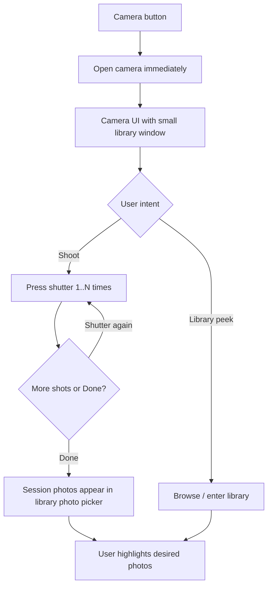

# Camera / photo module — flow echo + feasibility (2026-08-27)

> **Scope:** Analysis only. **No product code** in this deliverable.  
> **Plan source:** Cursor plan `camera_module_feasibility` (do not treat as build GO).  
> **Related:** [`2026-08-15-custom-library-picker-evaluation.md`](../plans/2026-08-15-custom-library-picker-evaluation.md) (why PHPicker was replaced).

---

## 1. Flow repeated (product intent)

1. Tap **Camera** → camera opens **immediately** (no “Take Photo / Library / Cancel” alert first).
2. Camera UI shows a **small window** that signals “you can also pick from the library.”
3. To capture: use the in-app shutter (not a one-shot system camera dismiss).
4. Press shutter **once or many times**; stay in camera until **Done**.
5. On **Done**, all shots from that session are **added into the library photo picker**.
6. User **highlights** which photos to keep / use.

**Assumed reading of steps 5–6:** destination is the **in-app MediaLibrary gallery** ([`src/screens/InAppLibraryPickerScreen.tsx`](../../src/screens/InAppLibraryPickerScreen.tsx)), not skipping straight to Select Photos. Select Photos may still sit **after** highlight (today’s edit/accept step) unless product later collapses that — open debt, not resolved here.

---

## 2. What exists today (gap)

| Desired | Today |
|--------|--------|
| Camera opens immediately | Camera tab → **Alert** → then `ImagePicker.launchCameraAsync` ([`src/navigation/captureFirstCameraFlow.ts`](../../src/navigation/captureFirstCameraFlow.ts), tab wiring in [`AppNavigator.tsx`](../../src/navigation/AppNavigator.tsx)) |
| Multi-shutter + Done | **No** — one system camera presentation; Create/Update paths often single asset |
| Camera + library peek on one screen | **No** — separate Alert branches; library is full-screen `InAppLibraryPicker` |
| Session shots into library picker | **No** — camera drafts pin to `draft-media/` and go to **Select Photos**; library picker only shows **MediaLibrary** assets |
| Highlight in library picker | Library multi-select exists; camera drafts are not MediaLibrary rows unless saved to Photos |

**Deps (package.json):**

- `expo-camera` ~16.1.6 — **listed, unused in `src/`** (no `CameraView` imports).
- `expo-image-picker` ~16.1.4 — **all live camera launches**.
- `expo-media-library` ~17.1.6 + `expo-image-multiple-picker` ^4.10.0 — in-app library grid.

**Draft handoff today:** `pinDraftMedia` → Select Photos (`uploadImmediately: false`) → Create Task / Update Progress. Library Accept resolves `ph://` via `getAssetInfoAsync({ shouldDownloadFromNetwork: true })` then pins (already a slow path).

---

## 3. Technical feasibility

### Feasible (with a custom camera screen)

- **Immediate open:** replace Alert + `launchCameraAsync` with a dedicated screen using **`expo-camera` `CameraView`**. Shutter = take picture → session thumbnails → **Done**.
- **Multi-shot session:** only with that custom UI. System `launchCameraAsync` **cannot** host “stay open, shutter N times, Done, plus library window.”
- **Small library window:** overlay (last-album thumb / mini-grid / Library chip). Tap → existing `InAppLibraryPicker` or a sheet. Not blocked by Expo.
- **Permissions:** Camera + Photo Library (mic only if video later). Custom camera needs explicit camera permission UX.

### Showstopper-class for step 5 as stated

#### Showstopper A — “Added to the library photo picker” vs MediaLibrary SoT

The in-app picker lists **device Photos** assets, not arbitrary `file://` camera drafts.

“Done → all photos appear in the library picker” requires one of:

1. **Write session shots into the device Photo Library** (`MediaLibrary.createAssetAsync` / album), then refresh the gallery; or  
2. **Fork the picker** into a **hybrid** UI: “This session” strip + MediaLibrary grid (camera files stay in `pinDraftMedia`, never enter Photos).

| Path | Feasibility | Cost / risk |
|------|-------------|-------------|
| 1. Save to Photos | Technically yes | Extra permission; Taskr shots appear in Photos; iCloud/slow; draft delete unclear; jobsite privacy |
| 2. Hybrid picker | Technically yes | **Cannot** stay on stock `expo-image-multiple-picker` as-is — custom list or parallel strip; more build than camera alone |

Without (1) or (2), step 5 **cannot** mean the current library grid. **Main product/tech collision.**

#### Showstopper B — System camera API

Keeping `launchCameraAsync` makes steps 2–4 **impossible**. Multi-shot + Done + library peek **requires** abandoning system camera UI for this module.

#### Showstopper C — Double selection UX (original PHPicker reason)

If Done → **library picker highlight** → still **Select Photos** → form, users again get **two highlight/review surfaces**. Feasible technically; product risk of reintroducing the repeating step left behind when PHPicker was removed — unless Select Photos becomes edit-only or is skipped when selection is already finalized.

### Serious constraints (polish killers, not hard stops)

- **Performance:** current library grid is already slow (`ph://` + FlatList + sequential pin on Accept). Hybrid/injected assets worsen this unless owned FlashList + thumbs (Option B from library evaluation) is in scope.
- **Limited Photos access (iOS):** library peek may only show limited set.
- **Simulator / Maestro:** custom `CameraView` + multi-shutter harder to automate; new fixtures needed.
- **Native rebuild:** `expo-camera` present ≠ path proven on current binary; may need fresh dev client / EAS build.
- **Capture-first destination alert** (Create vs Update after Select Photos) must be redesigned around Done → library → highlight.

---

## 4. Feasibility verdict

| Slice | Verdict |
|-------|---------|
| Immediate custom camera + multi-shutter + Done | **Feasible** (`expo-camera`; replace ImagePicker camera path) |
| Small library peek on camera UI | **Feasible** (overlay → existing or hybrid library) |
| Done → shots appear **inside current MediaLibrary picker** | **Blocked unless** save-to-Photos **or** hybrid picker rewrite |
| Highlight then continue to form / Select Photos | **Feasible**; watch **double-select** UX regression |

**Overall:** Camera session (steps 1–4) is a normal custom-camera build. The **real showstopper** is step 5’s coupling to the **current** library picker SoT.

---

## 5. Decisions required before any **production** wiring GO

1. **Step 5 destination:** **LOCKED (2026-08-27):** **hybrid** session strip + MediaLibrary (no Photos write). Module scaffold: `src/modules/captureSession/` — **not wired** to AppNavigator; A/B guide `../plans/2026-08-27-capture-session-module-ab.md`.
2. **Select Photos after highlight:** keep as edit/accept, edit-only, or skip when selection already done.
3. **Entry scope:** Camera tab only vs also Create Task / Update Progress / Select Photos “Add”.
4. **Library perf:** ship camera on slow grid, or require FlashList/thumbs Option B in the same milestone.

Until wiring GO: keep production Camera tab on current capture-first path.

---

## 6. Explicit non-deliverables (this doc)

- No `CameraView` screen, navigation, or Maestro flows.
- No ROADMAP milestone close / open unless product schedules one later.
- No change to PHPicker vs in-app library decision beyond citing the collision with step 5.
