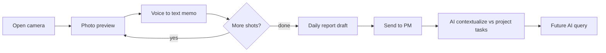

# Daily capture memo → daily report → AI (vision lock)

**Date:** 2026-08-27  
**Status:** Phase 0 product lock — **no schema apply, no production build GO**  
**Roadmap slot:** Parked pipeline after **`M-AUTHZ-02`**, feeds corpus into **`M-AI-01`** (Order 15.07). Does **not** jump `M-OPS-ENV-01` / `M-BILL-01` / App Store.  
**Related:** [`2026-08-27-camera-photo-module-feasibility.md`](./2026-08-27-camera-photo-module-feasibility.md), [`2026-08-27-capture-session-module-ab.md`](../plans/2026-08-27-capture-session-module-ab.md), [`2026-08-24-m-ai-01-query-gateway-planning-brief.md`](../plans/2026-08-24-m-ai-01-query-gateway-planning-brief.md)

---

## 1. Locked product assumption

**Daily Report is a first-class project-day artifact** (site diary package: ordered photos + voice/typed memos), **not** merely a bag of task updates.

- AI may **suggest** links to tasks; the report remains its own queryable object.
- Workers may still use classic **Create Task / Update Progress** from the same camera session when they want task attachment instead of (or in addition to) a daily report.
- Confirmed as the default in the 2026-08-27 vision plan; change only with explicit product GO.

---

## 2. Target user loop

| Step | Product meaning |
|------|-----------------|
| Camera → preview → repeat | Burst capture session (`captureSession` direction) |
| Voice → text per photo or per burst | Field memo; human edits text before commit |
| Done → daily report | One package for **this project + this calendar day** |
| Send to PM | Explicit submit: PM/CA in-app surface + push; not silent upload |
| AI contextualize | Suggest task links / summary from **this project’s** tasks only; cite or abstain |
| Future query | Same isolation wall as `M-AI-01` |

**Report date / timezone (default until product revises):** author’s device local calendar date at first shot of the draft; store `report_date` as `date` (no time). Multi-shift midnight edge cases deferred.

---

## 3. Non-goals

- Standalone consumer camera app outside Taskr
- AI auto-closing or auto-completing tasks without human confirm
- Cross-project / cross-company RAG
- Replacing Update Progress or Create Task
- Overloading the existing **Reports** tab (task stats) — daily reports need a distinct surface
- Extending client-side Create Task LLM keys as the production Q&A path (M-AI-01 gateway rules apply)

---

## 4. What exists today (reuse)

| Piece | Today | Gap for this vision |
|-------|--------|---------------------|
| Capture loop | `src/modules/captureSession/`, Camera tab / `captureFirstCameraFlow.ts` | Production Camera → hybrid session; destination **Daily report** alongside Create/Update |
| Photo package | Select Photos → Create / Update / project unattached | New destination: daily report draft |
| Voice → text | `VoiceTaskInput.tsx` + `transcribe-audio.ts` (UI disabled) | Re-enable memo control; attach transcript to report item |
| Text → structure LLM | `task-llm-service.ts` / `chat-service.ts` | Patterns only for suggest/summarize — production Q&A stays Edge gateway |
| Reports tab | Task stats (`ReportsScreen.tsx`) | Do not overload; add Daily reports elsewhere |
| Field Q&A | M-AI-01 planning only | Daily reports = corpus slice for same gateway |

---

## 5. Domain sketch (conceptual — no live DDL yet)

### Entities

- **`daily_report`**
  - `id`, `company_id`, `project_id`, `report_date`, `author_id`
  - `status`: `draft` | `submitted`
  - `summary_text` (optional human or AI-assisted paragraph; AI writeback only after human accept in later phases)
  - timestamps (`created_at`, `updated_at`, `submitted_at`)

- **`daily_report_item`**
  - `id`, `daily_report_id`, `sort_order`
  - photo storage path (same bucket patterns as task evidence; entity type TBD e.g. `daily-report`)
  - `memo_text` (voice transcript and/or typed)
  - `suggested_task_id` (AI, nullable), `linked_task_id` (human-confirmed, nullable)

- **Notify on submit** (Phase 2): PMs + CA with project access — push + in-app list; no separate recipient table required for v1 if derived from project membership + seat/role.

### Hard rules

- Wrong-project data = **safety defect** (same as M-AI-01)
- Submit only to roles that can see that project (post-`M-AUTHZ-02` multi-company aware)
- AI never invents task completion; suggestions need human confirm to mutate tasks
- Offline: local draft capture; submit when network returns (align upload/draft patterns)
- Isolation: company + project walls on every read/write RPC

---

## 6. Phased delivery (build gates)

Current commercial spine unchanged: **`M-OPS-ENV-01` → M-BILL-01 → App Store → M-OPS-03 / M-AUTHZ-02 → M-AI-01`**.

| Phase | Name | Build when | Deliverable |
|-------|------|------------|-------------|
| **0** | Product lock | **Now (this doc)** | Vision, entities, non-goals, roadmap park |
| **1** | Capture + memo | After `captureSession` production cutover; idle-parallel OK **without** live daily_report DDL if drafts stay local — **persist DDL = Human Gate** | Camera → session → voice memo → local/synced draft package |
| **2** | Send to PM | After Phase 1 + project membership clarity (`M-AUTHZ-02` preferred) | Submit, PM/CA inbox, push |
| **3** | AI contextualize | With / after **M-AI-01** gateway | Task-link suggestions + summary; cite or abstain |
| **4** | AI query | M-AI-01 corpus includes daily reports | “What did crew report about Level 3 yesterday?” |

Detailed Phase 1–3 acceptance + file touch list: [`../plans/2026-08-27-daily-report-phases-1-3-kickoff.md`](../plans/2026-08-27-daily-report-phases-1-3-kickoff.md).

---

## 7. Why this is powerful (and risky)

**Powerful:** Jobsite walk → shoot → talk → send up the chain; compounds into the dataset M-AI-01 needs; differentiates from “another task app.”

**Risks:** noisy-site speech accuracy; EN/zh-TW; who is “PM” on multi-company projects; draft orphan Storage cost (`M-PERF-02`); users expecting AI to replace human review.

---

## 8. Explicitly not started

- No Supabase migration apply for `daily_report*`
- No production Camera destination wiring in this Phase 0 deliverable
- No push notification plumbing
- No M-AI-01 implementation (planning brief still gates build)

---

## 9. Resume checklist (future Builder)

1. Read this doc + kickoff plan + captureSession A/B plan  
2. Confirm Human Gate for any DDL  
3. Prefer extending `captureSession` + re-enabling `transcribe-audio` over a third camera stack  
4. Wire daily reports into M-AI-01 corpus only through the Edge gateway (no mobile LLM keys for Q&A)
