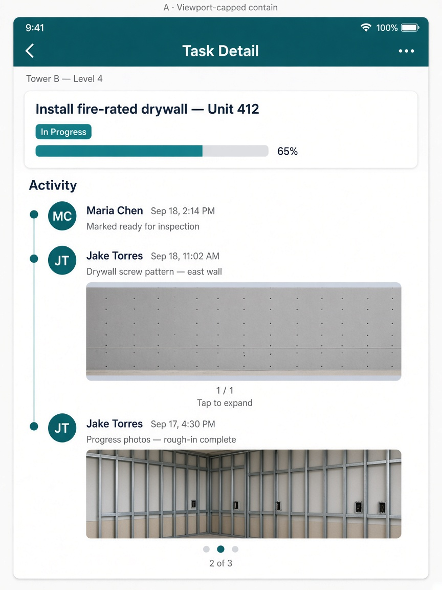
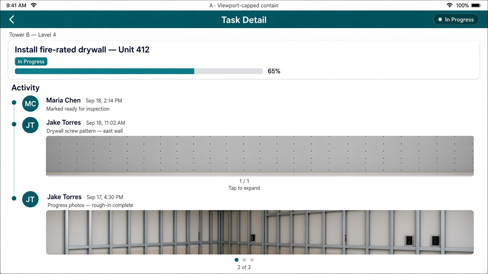
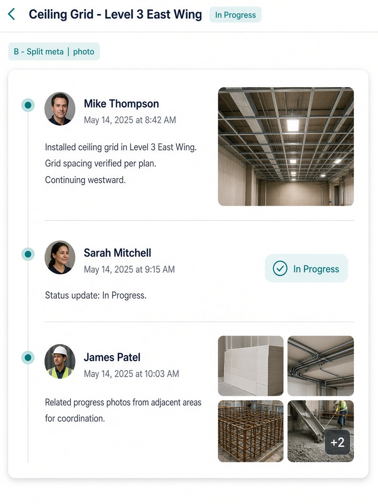
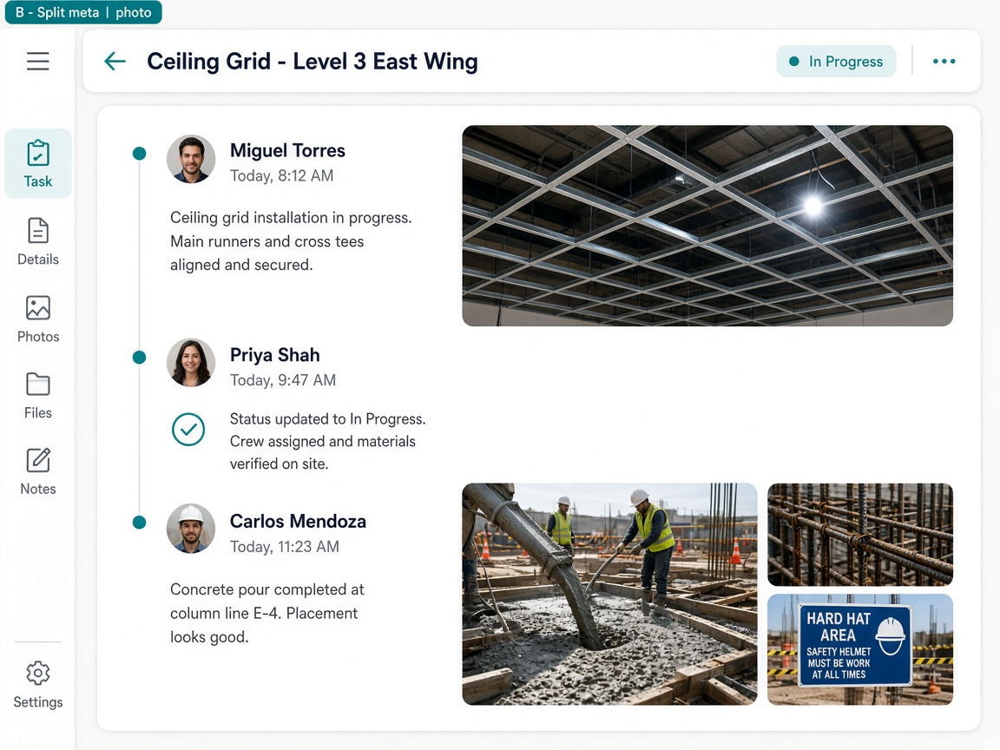
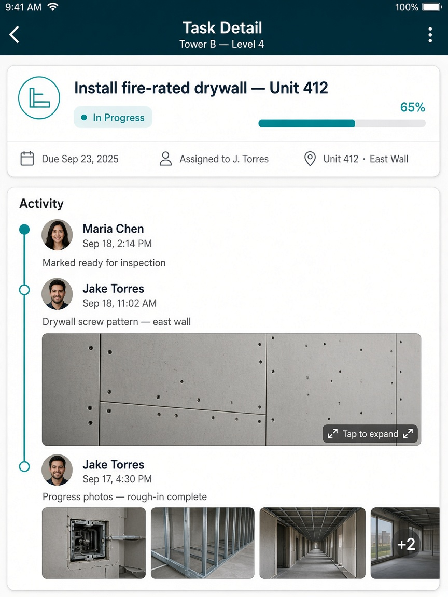
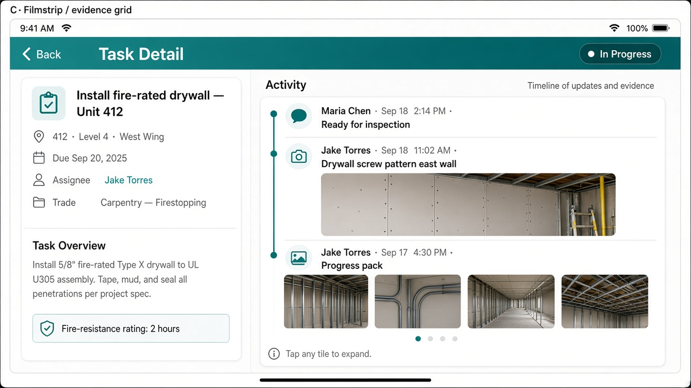

# iPad Task Detail timeline — layout alternatives

**Status:** **C picked and implemented** (2026-09-19). Phone square hero unchanged.  
**Date:** 2026-09-19  
**Surface:** Task Detail → activity timeline (`TaskActivityTimeline` + `IpadTimelineEvidenceStrip`)  
**Scope:** iPad portrait **and** landscape. Phone stacked layout stays as-is.  
**Pick:** **C · Filmstrip / evidence grid**

Mocks are proposed UI, not simulator captures. Ignore extra chrome some frames invented (sidebars, inspector panels, landscape nav rails). Only the **timeline photo treatment** is in play.

---

## Problem

On iPad, a photo event is too tall to see as a whole without scrolling, in both orientations.

**Cause (current code):** the lead photo shell is a **full-width square** (`aspectRatio: 1`) with `contentFit="cover"` in `src/components/taskDetail/TaskActivityTimeline.tsx`. Content width on an 11" iPad is ~746pt, so one photo is ~746×746pt — taller than most of the remaining viewport after header + caption. Multi-photo events swipe horizontally inside that same square; they do not get shorter.

`useTabletCardGridLayout` (Tasks/Dashboard 2/3 columns) is a **different** surface. Do not reuse it for this timeline.

---

## Compare

| | **A · Viewport-capped contain** | **B · Split meta \| photo** | **C · Filmstrip / evidence grid** |
|---|---|---|---|
| Layout | Caption stacked above a height-capped photo stage | Caption left, photo right (two columns) | Compact header + tile strip / 2–4-up grid |
| Photo height (11") | ~43vh portrait / ~38vh landscape (`clamp` 360–520 / 248–336) | Fixed **200pt** portrait / **260pt** landscape | Media block **≤200–220pt** |
| Fit | **`contain`** — no crop, letterbox OK | **`cover`** — crop to the tile | **`cover`** — crop to tiles |
| Multi-photo | One capped pager; swipe; `n / total` + dots | 2-up, or primary + thumbs, **same row height** | Horizontal filmstrip; **+N** overflow |
| Feed density | Lowest (largest evidence in-feed) | Medium | Highest |
| Best if | You want to **read the photo in the feed** | You want **caption + photo in one glance** | You want to **scan many events**, tap to inspect |
| Main tradeoff | Letterboxing on portrait shots | Crop + new split-row code path | Tap required for uncropped review |

All three keep the existing full-screen gallery (`task-activity-timeline__photo_viewer`) for tap-to-expand. Fat-finger floor: ≥44pt tap targets.

---

## A · Viewport-capped contain

Keep today’s stacked event (meta → photo → pager). Cap the photo **stage** to a fraction of the window. Use **contain** so jobsite edges stay visible.

A mockups were regenerated 2026-09-19 (first pass scrambled the nested photos).

### Portrait

### Landscape

### Rules

| Rule | iPad portrait | iPad landscape |
|---|---:|---:|
| Media-stage height | `clamp(360, 43vh, 520)` | `clamp(248, 38vh, 336)` |
| 11" expected media height | ~513pt at 834×1194 | ~317pt at 1194×834 |
| Image fit | `contain`, pale slate letterbox | same |
| Event chrome budget | ≤238pt (actor, two-line caption, pager) | same |
| Max photo-event height | ~751pt | ~555pt |

- Recalculate from `useWindowDimensions()` on rotation and Split View. Do **not** use `useTabletCardGridLayout`.
- 1–4 photos: **one** equally capped horizontal pager. Do not stack photos vertically or use a 2×2 grid (that shrinks landscape evidence).
- Feed is the only vertical scroll. Photo stage has no vertical scroll.
- Phone path unchanged.

**Pros:** uncropped evidence; familiar swipe gallery; four photos do not multiply card height.  
**Cons:** letterboxing; tap still needed for fine inspection; captions must be line-clamped or the height guarantee breaks.

---

## B · Split meta | photo

Each photo event is a **two-column row**. Photo height is a **fixed token**, independent of row width — that is the direct fix for square-from-width blow-up.

### Portrait

### Landscape

The left icon rail in the landscape mock is **not** part of this proposal.

### Rules

| Aspect | Portrait (11" / 13") | Landscape (11" / 13") |
|---|---|---|
| Meta : photo | **55 / 45** | **38 / 62** |
| Photo-tile height | **200pt** | **260pt** |
| Gutter | 16pt | 16pt |
| Fit | `cover`, centered | same |
| 1 photo | One tile, min ~220×180pt | same floor |
| 2 photos | 2-up, 4pt gap, full tile height | same |
| 3–4+ photos | Primary + thumb strip + **+N** inside the **same** height band | same |

Portrait stays side-by-side (not stacked). Below ~600pt content width, fall back to phone layout (out of iPad scope).

Row height = `max(meta natural height, fixed photo height) + padding`. Captions can grow the row; **photos never do**.

**Pros:** caption and photo visible together; predictable height vs photo count; landscape width goes to evidence.  
**Cons:** `cover` crops; meta column wraps captions more; 3–4 photo primary+thumbs is a new sub-layout (not a restyle of the current pager); sticky `onEntryLayout` math needs a Planner pass.

---

## C · Filmstrip / evidence grid

Compact header, then a **short evidence pack**. Single photo is a wide framed still (~full card width × 200pt), not a viewport-tall hero. Multiple photos are tiles.

### Portrait

### Landscape

The left task-overview pane in the landscape mock is **not** part of this proposal.

### Rules

| Token | Value |
|---|---|
| Header block | 72–88pt (avatar, actor/time, 1–2 line caption) |
| Media max height | **200pt** (220pt landscape single-photo if header is one line) |
| Tile aspect | 4:3 or square crop (`cover`) |
| Tile gap | 8pt · radius 12pt · min tap 44pt |
| Rows | **1 row only**; overflow = horizontal scroll + **+N** |
| 1 photo | Full width × ~200pt framed still |
| 2 photos | 2-up, ~180pt tall |
| 3+ | Filmstrip; portrait ~2–3 visible; landscape ~3–4; 4-up can fit 11" landscape without scroll |

Typical event card ~300–340pt → 2–3 mixed events per viewport.

**Pros:** densest feed; evidence-pack mental model; single photo still large vs postage-stamp MEDIA tokens (112/128).  
**Cons:** tap for full image; crop; nested horizontal vs vertical scroll (keep `directionalLockEnabled`).

---

## Shared implementation notes (after a pick)

- Gate with `Platform.isPad` (or content-width ≥ ~700pt for Stage Manager) **inside** `TaskActivityTimeline`. Phone keeps `aspectRatio: 1` + `cover`.
- Preserve `task-activity-timeline__photo_stack-*`, lead-photo, swipe-surface, and viewer testIDs; add tile IDs if C/B grids land.
- Jest that asserts square/`cover` must get an iPad branch.
- Mixes that are cheap if you want them:
  - **B + A fit:** split row, but `contain` instead of `cover`.
  - **A + C multi:** capped contain for 1 photo; filmstrip only when count ≥ 2.

---

## Acceptance (headed iPad, once built)

Run 11" (834×1194 / 1194×834) and spot-check 13".

1. One photo event: actor + caption + media visible without scrolling **inside** that entry.
2. Media height matches the chosen variant’s token (±1pt) in both orientations.
3. 3- and 4-photo events do not grow taller than the 1-photo case (A pager / B band / C strip).
4. Tap opens the existing gallery at the correct index; swipe vs timeline scroll do not fight.
5. iPhone layout unchanged.

---

## Pick

**C** selected 2026-09-19. Implementation:

- `src/components/taskDetail/ipadTimelineEvidenceLayout.ts` — slot / height math
- `src/components/taskDetail/IpadTimelineEvidenceStrip.tsx` — iPad media
- `src/components/taskDetail/TaskActivityTimeline.tsx` — `Platform.OS === "ios" && isPad` branch

Phone path still uses `aspectRatio: 1` + `cover` swipe shell. Full-screen viewer is unchanged (`contain`). Headed iPad sim smoke is the remaining QA (11" portrait + landscape).
