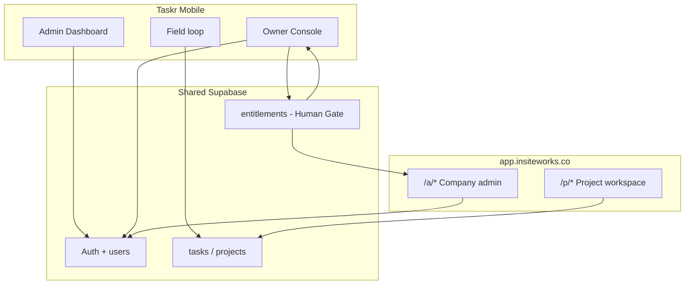

# Dual-track kickoff — Owner Console + Web (normal users)

**Date:** 2026-08-22  
**Updated:** 2026-08-22 (Owner Console three-section IA)  
**Goal:** Finish planning for both surfaces, then **start coding in parallel** on disjoint ownership where possible.

**Child plans:**
- Owner modules: `2026-08-22-owner-console-modules-complete.md`
- Owner users: `2026-08-22-owner-console-user-management.md`
- Web normal users: `2026-08-22-web-normal-users-kickoff.md`
- Web implementation tasks: `2026-08-06-ws-web-01-and-02-web-admin-shell-and-project-workspace.md`

---

## Two products, one backend

---

## Parallel tracks (kickoff week)

| Track | Owner | Files (disjoint) | Milestone |
|---|---|---|---|
| **O1** | Owner harness — three-section shell | `OwnerConsoleScreen`, `src/screens/owner/` section hubs + stubs | M-OPS-01 B1 |
| **O2** | Data integrity Phase B prep | `taskWorkflowGaps` SQL spec; F-003 counter surface | M-OPS-01 B5 prep |
| **O3** | Entitlements schema design | `docs/` + migration **draft** (no live apply without GO) | M-OPS-01 B4 |
| **O4** | Tenant ops UI | Users & companies forms; Usage vs caps stubs | M-OPS-01 B4 after GO |
| **O5** | Monitoring KPI rollup spec | daily metrics SQL/Edge design (no live apply until B2) | M-OPS-01 B2 |
| **O6** | Economics stubs | manual cost entry UI; Stripe read placeholder | M-OPS-01 B3 |
| **W0–W3** | Web bootstrap + shell + guards | `src/webRouter/`, `src/components/web/` | M-WEB-01 |
| **WA** | `/a/users`, `/a/projects` | `src/screens/web/admin/` | M-WEB-01 |
| **WP** | `/p/workspace`, `/p/team`, `/p/settings` | `src/screens/web/project/` | M-WEB-02 |

**Single-writer (do not parallelize):**
- Entitlements migration live apply
- Stripe webhook secrets / Edge function
- `platform_superuser` RLS (Human Gate)
- Shared `src/types/entitlements.ts` (define once, then both tracks import)
- Daily KPI rollup table live apply (when schema reviewed)

---

## Recommended kickoff order (same sprint)

### Day 0 — Shared contract (2–4 hrs)
1. Draft `src/types/entitlements.ts` + ERD in docs (no live SQL)
2. Lock: no `company_id` mutation on user update (shared validator helper)
3. Draft KPI metric list + rollup ERD (Monitoring §1a in modules-complete)
4. `npm run dev:doctor`; web baseline `expo start --web` smoke

### Days 1–3 — Parallel build
| Parallel A (Owner Console) | Parallel B (Web) |
|---|---|
| O1 three-section shell + section entry stubs | W0–W3 web shell + login dispatch |
| O2 Gaps SQL twin **spec** (read-only query file) | WA `/a/users` + `/a/projects` |
| O5 KPI rollup spec (docs/SQL draft) | WP project workspace shell |
| O6 Economics stub screens | |

### Days 4–5 — Integration
- O4 Tenant ops tabs (Plans / Users / Usage) wired to entitlements types (mock caps until B4 live)
- Web admin invite respects same seat types (mock until webhook)
- Jest + manual cross-check: Henry web ≠ Owner cross-tenant list

### Human Gate checkpoint (before prod writes)
- [ ] Entitlements schema review → live apply
- [ ] Owner user create via service-role path
- [ ] Optional: `platform_superuser` RLS
- [ ] KPI rollup table (if not derived live-only)

---

## Module checklist — Owner Console (all planned)

Full spec: `2026-08-22-owner-console-modules-complete.md`.

| Section | Module | Build phase |
|---|---|---|
| **System monitoring** | KPI dashboard | B2 |
| | Reliability & incidents | B5 |
| | Activation funnel | B2+ |
| | Promo attribution fields | C |
| | Alerting thresholds | C |
| | Release / build adoption | B5+ |
| **Data integrity** | Workflow Gaps | **A live** |
| | Platform audit / SQL twin | B5 |
| | Deferred-schema counter (F-003) | B5 |
| **Economics** | Revenue (Stripe SoT) | B3→B4 |
| | Platform costs | B3 |
| | Unit economics / margin | B3+ |
| | Stripe reconciliation | B4 |
| **Tenant operations** | Plans & entitlements | B4 |
| | Users & companies | B4 |
| | Usage vs caps | B4 |
| | Owner audit log | B4 |

## Module checklist — Web (kickoff wave 1)

| Area | Routes | Plan |
|---|---|---|
| Shell + auth | login, layout, guards | ws-web-01 plan Tasks 1–5 |
| Company admin | `/a/dashboard`, `/a/users`, `/a/projects` + stubs | Tasks 8–13 |
| Project admin | `/p/:id/workspace`, `team`, `settings`, `tasks` | Tasks 14–15 |
| Deferred | DMS, reports, billing UI, member compact | M-DMS / M-WEB-03 |

---

## Success criteria for “kickoff complete”

1. Owner Console opens **three sections** (Monitoring / Economics / Tenant ops) with navigable stubs
2. Workflow Gaps reachable under **Monitoring → Data integrity** (top-level shortcut OK for Phase A until B1 nav lands)
3. Tenant ops hub: Plans / Users / Usage tabs — stubs OK
4. Web: admin logs in → `/a/users` works company-scoped
5. Web: lead PM → `/p/:id/team` works project-scoped
6. Entitlements + KPI metric types shared in docs/types; live enforcement flagged “pending Human Gate”
7. `tsc --noEmit` + targeted Jest green
8. ROADMAP/NOW updated when B1 + W shell land

---

## What we are NOT doing in this kickoff

- Customer-managed storage (WS-STORAGE)
- DMS live DDL
- M-AUTHZ-02 project invite product
- Feedback inbox on Owner Console (parked → future Product signals)
- Jobsite cost (`M-COST-01`) on Owner Console
- Combining Plans + Users into one form screen (tabs under Tenant ops only)
- Live alerting / push notifications (Phase C)

---

## Next step

**User GO on this kickoff doc** → Builder starts **O1 + W0** in parallel (disjoint files), then WA + section stubs.
