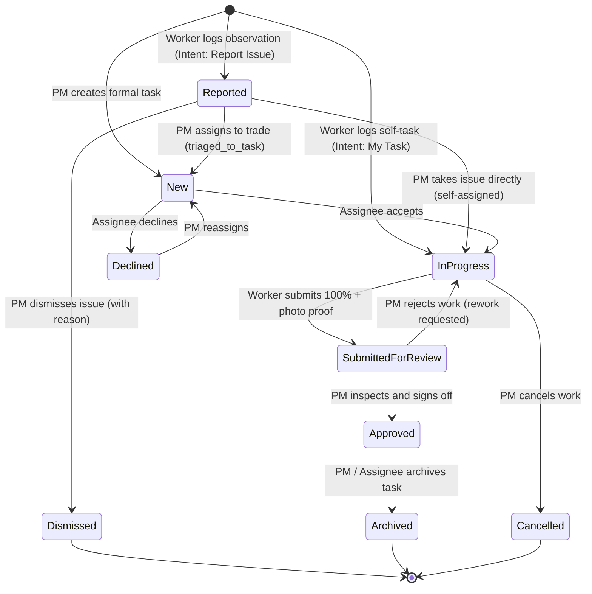

# Plan: Phase 2 Explicit Triage Lifecycle & Schema Evolution

**Date:** 2026-09-02  
**Status:** DRAFT (Post-Commercial Spine Implementation Plan)  
**Prerequisites:** 
- Phase 1 Dual-Intent UI Contract shipped and validated in field.
- App Store & Stripe Live on PROD (`ENV Phase D`).
- `M-AUTHZ-02` Multi-Company Project Membership landed.
**Related Code & Migrations:**
- `src/state/taskStore.supabase.ts`
- `src/state/taskQueryPredicates.ts`
- `supabase/migrations/` (Human-Gated Live SQL)

---

## 1. Objectives & Architectural Scope

While Phase 1 achieves the dual-intent workflow with **Zero DDL** (using `status: 'new'` and `assigned_to: []`), Phase 2 introduces formal semantic rigor into the Postgres database, audit trail, and state store:

1. **Explicit Status Taxonomy:** Formally differentiate unverified field observations (`reported`) from assigned tasks awaiting worker acceptance (`new` / `assigned`).
2. **First-Class Dismissal State:** Add `dismissed` with structured dismissal reason codes (Duplicate, Out of Scope, Self-Resolved, Invalid) instead of overloading `cancelled`.
3. **Comprehensive Audit Trail in `task_activities`:** Record distinct activity events when a PM validates/triages an issue or dismisses it.
4. **Owner HQ & KPI Metrics:** Enable analytics on triage response times, discovery-to-task conversion rates, and cross-trade defect patterns.

---

## 2. Database Schema & Migration Specification (Human Gate)

```sql
-- Migration: 202609XX000100_phase2_issue_triage_lifecycle.sql
-- Description: Adds 'reported' and 'dismissed' to TaskStatus and extends task_activities

BEGIN;

-- 1. Extend tasks status check constraint
ALTER TABLE tasks 
  DROP CONSTRAINT IF EXISTS tasks_status_check;

ALTER TABLE tasks 
  ADD CONSTRAINT tasks_status_check 
  CHECK (status IN (
    'reported',              -- Newly logged field observation awaiting PM triage
    'new',                   -- Triaged and assigned to worker, awaiting acceptance
    'not_started',           -- Legacy alias for new
    'assigned',              -- Legacy alias for new
    'received',              -- Legacy alias for new
    'accepted',              -- Legacy alias for in_progress
    'in_progress',           -- Active work in progress
    'wip',                   -- Legacy alias for in_progress
    'submitted_for_review',  -- Work complete, awaiting PM sign-off
    'reviewing',             -- Legacy alias for submitted_for_review
    'approved',              -- Formally signed off
    'completed',             -- Legacy alias for approved
    'done',                  -- Legacy alias for approved
    'rejected',              -- PM sent work back for rework
    'declined',              -- Assignee declined task assignment
    'cancelled',             -- Formally cancelled by PM
    'dismissed'              -- Issue rejected during triage
  ));

-- 2. Add triage metadata columns (optional convenience fields)
ALTER TABLE tasks
  ADD COLUMN IF NOT EXISTS origin_intent text DEFAULT 'task',
  ADD COLUMN IF NOT EXISTS dismissed_reason text,
  ADD COLUMN IF NOT EXISTS triaged_at timestamptz,
  ADD COLUMN IF NOT EXISTS triaged_by uuid REFERENCES users(id);

-- 3. Extend task_activities activity_type check constraint
ALTER TABLE task_activities
  DROP CONSTRAINT IF EXISTS task_activities_activity_type_check;

ALTER TABLE task_activities
  ADD CONSTRAINT task_activities_activity_type_check
  CHECK (activity_type IN (
    'creation',
    'status_change',
    'assignment',
    'progress_update',
    'review',
    'approval',
    'rejection',
    'cancellation',
    'archival',
    'issue_reported',
    'triaged_to_task',
    'issue_dismissed'
  ));

-- 4. Index for PM triage performance
CREATE INDEX CONCURRENTLY IF NOT EXISTS idx_tasks_project_triage
  ON tasks (project_id, status)
  WHERE status = 'reported';

COMMIT;
```

---

## 3. State Store & Predicates Delta (`taskStore.supabase.ts`)

### 3.1 Type Definitions & Predicates (`taskQueryPredicates.ts`)
```typescript
export type TaskStatus =
  | 'reported'
  | 'new'
  | 'not_started'
  | 'assigned'
  | 'received'
  | 'accepted'
  | 'in_progress'
  | 'wip'
  | 'submitted_for_review'
  | 'reviewing'
  | 'approved'
  | 'completed'
  | 'done'
  | 'rejected'
  | 'cancelled'
  | 'declined'
  | 'dismissed';

export function isTriageRequired(status: string | null | undefined): boolean {
  return status === 'reported';
}

export function isDismissedIssue(status: string | null | undefined): boolean {
  return status === 'dismissed';
}
```

### 3.2 State Store Actions (`taskStore.supabase.ts`)
```typescript
interface TaskStore {
  // Existing methods ...

  // Phase 2 Triage Actions
  triageIssueToTask: (
    taskId: string, 
    payload: {
      assignedTo: string[];
      primaryAssigneeId?: string;
      dueDate?: string;
      priority?: Priority;
      category?: TaskCategory;
      billingStatus?: BillingStatus;
    },
    triagedByUserId: string
  ) => Promise<void>;

  dismissIssue: (
    taskId: string,
    reason: string,
    dismissedByUserId: string
  ) => Promise<void>;
}
```

---

## 4. Lifecycle State Machine Diagram



---

## 5. Rollout & Risk Mitigation

1. **Deferred Schema Compatibility (F-003):**
   - Ensure `taskDeferredSchemaCompat.ts` includes `origin_intent`, `dismissed_reason`, `triaged_at`, and `triaged_by` in its fallback stripper list so pre-migration local/staging environments remain non-breaking.
2. **HQ & Edge Function Compatibility:**
   - Verify `owner-ops-read` and KPI Edge functions filter out `status = 'reported'` and `status = 'dismissed'` from active jobsite cycle-time and WIP metrics.
3. **Maestro Automated Preflight:**
   - Update `marketing-store-shots.yaml` and `dual-user` test flows to test both the worker reporting flow and the PM triage verification sequence.
