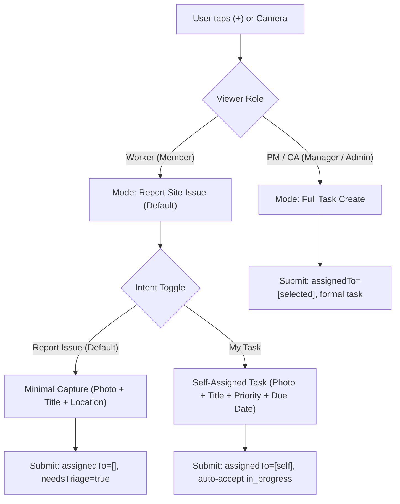

# Specification: Phase 1 Dual-Intent Create Task UI Contract (Report Issue vs. My Task)

**Date:** 2026-09-02  
**Status:** SPECIFICATION (Zero-DDL Implementation Contract)  
**Target Milestone:** Post-RC UX Refinement (Idle-Parallel)  
**Related Code:**
- `src/screens/CreateTaskScreen.tsx` (Form UI & field presentation)
- `src/ui/viewAdapters/useCreateTaskViewAdapter.ts` (View adapter & validation state)
- `src/ui/contracts/viewAdapters.ts` (Form models & contract interfaces)
- `src/utils/taskCreateValidation.ts` (Create validation prerequisites)
- `src/utils/taskStatusReconciler.ts` (State reconciler guard rules)

---

## 1. Product Overview & Intent Model

To bridge the gap between **cross-trade deficiency reporting** and **direct trade execution** without schema migrations or table fragmentation, Phase 1 introduces a **Dual-Intent Create Mode** in `CreateTaskScreen`.



---

## 2. Intent Modes & Role Defaults

### 2.1 Mode Definitions

| Create Mode | Key | Primary Audience | Intent & Behavior | Default Initial Status |
|---|---|---|---|---|
| **Report Issue** | `report_issue` | Workers / Subcontractors discovering cross-trade issues | Rapid observation logging ($<10$s). Omits assignee, billing status, and due date. | `new` (`needs_triage: true`, `assigned_to: []`) |
| **My Task** | `my_task` | Workers / Foremen logging own to-do items | Direct personal task execution. Assignee is locked to current user. Omits billing status. | `in_progress` (Auto-accepted) |
| **Full Task** | `full_task` | PMs / Supervisors / Company Admins | Formal task dispatch with full metadata, delegation, priority, and billing classification. | `new` or `in_progress` (if self-assigned) |

### 2.2 Default Selection by Role
- **When user is `worker` / `member`:**
  - Default selected mode: `report_issue`.
  - Intent selector visible at top of form: `[ 🚩 Report Issue | 🔨 My Task ]`.
- **When user is `manager` / `supervisor` / `admin` / `company_admin`:**
  - Default selected mode: `full_task`.
  - Intent selector hidden (full metadata form rendered).

---

## 3. Field Visibility & Requirement Matrix

| Field | `report_issue` (Worker Default) | `my_task` (Worker Bypass) | `full_task` (PM / Admin) |
|---|---|---|---|
| **Photos / Attachments** | **Required ($\ge 1$)** | Optional | Optional |
| **Title** | **Required** | **Required** | **Required** |
| **Description** | Optional | Optional | Optional |
| **Location on Site** | **Required** | Optional | Optional |
| **Priority** | Hidden (defaults to `medium`) | Optional (defaults to `medium`) | Optional |
| **Assignee Picker** | **Hidden** (submits `[]`) | **Hidden** (locked to `[user.id]`) | **Visible** (filtered by rank) |
| **Due Date** | **Hidden** (omitted) | Optional (defaults to today+7d) | **Visible** |
| **Category** | Optional | Optional | **Visible** |
| **Billing Status** | **Hidden** (defaults `non_billable`) | **Hidden** (defaults `non_billable`) | **Visible** |
| **Tags / Containers** | Hidden | Optional | **Visible** |

---

## 4. View Adapter & Form Model Delta

### 4.1 Form Model Extension (`src/ui/contracts/viewAdapters.ts`)

```typescript
export type CreateTaskIntentMode = "report_issue" | "my_task" | "full_task";

export interface CreateTaskFormModel {
  // Existing fields
  title: string;
  description: string;
  priority: Priority | string;
  category: TaskCategory | string;
  billingStatus: BillingStatus | string;
  dueDate: Date;
  assignedTo: string[];
  primaryAssigneeId?: string;
  delegatedUserIds?: string[];
  locationOnSite: string;
  attachments: Array<SelectedPhoto | string>;
  tags: string[];
  containerId?: string;
  subContainerId?: string;
  taskReference: string;
  
  // Phase 1 Intent Additions
  intentMode: CreateTaskIntentMode;
  isUrgentHazard?: boolean;
}
```

### 4.2 Adapter Output Contract Delta (`useCreateTaskViewAdapter.ts`)

```typescript
export interface CreateTaskViewAdapterOutput {
  // Existing output fields ...
  
  // Phase 1 Chrome Contracts
  intentSelector: {
    visible: boolean;
    activeMode: CreateTaskIntentMode;
    availableModes: Array<{
      id: CreateTaskIntentMode;
      label: string;
      icon: string;
    }>;
  };
  fieldVisibility: {
    showAssigneePicker: boolean;
    showDueDatePicker: boolean;
    showBillingPicker: boolean;
    showPriorityPicker: boolean;
    showCategoryPicker: boolean;
    showLocationPicker: boolean;
    showAdvancedSection: boolean;
  };
  submitButtonLabel: string; // "Report Issue" vs "Create Task" vs "Start My Task"
}
```

---

## 5. Validation Contract Delta (`src/utils/taskCreateValidation.ts`)

Currently, `validateTaskCreateInput` enforces:
1. `NO_TITLE`
2. `NO_PROJECT`
3. `NO_ORIGINATOR`
4. `NO_ASSIGNEES` (Enforces `assignedTo.length > 0`)

### Updated Validation Rules:
```typescript
export function validateTaskCreateInput(
  input: TaskCreateValidationInput & { intentMode?: CreateTaskIntentMode },
): TaskCreateValidationErrorCode[] {
  const errors: TaskCreateValidationErrorCode[] = [];
  const title = typeof input.title === "string" ? input.title.trim() : "";
  const projectId = typeof input.projectId === "string" ? input.projectId.trim() : "";
  const assignedBy = typeof input.assignedBy === "string" ? input.assignedBy.trim() : "";
  const assignees = normalizeCreateAssigneeIds(input.assignedTo);
  const isReportIntent = input.intentMode === "report_issue";

  if (!title) {
    errors.push("NO_TITLE");
  }
  if (!projectId) {
    errors.push("NO_PROJECT");
  }
  if (!assignedBy) {
    errors.push("NO_ORIGINATOR");
  }
  
  // Assignees are ONLY required for direct tasks, NOT for issue reports
  if (!isReportIntent && assignees.length === 0) {
    errors.push("NO_ASSIGNEES");
  }

  return errors;
}
```

---

## 6. PM Triage & Reconciliation Guard Contract

### 6.1 State Reconciler Guard (`src/utils/taskStatusReconciler.ts`)
- **Current Behavior:** Reconciler auto-cancels unassigned tasks (`GAP_UNASSIGNED_OPEN` and `GAP_UNASSIGNED_WIP`).
- **Updated Guard:** 
  - `GAP_UNASSIGNED_WIP` (`status: 'in_progress'` with `assigned_to = []`) $\to$ **Auto-Cancel** (Safety defect).
  - `GAP_UNASSIGNED_OPEN` (`status: 'new'` with `assigned_to = []`) $\to$ **Preserve as Triage Item** (Valid reported issue awaiting assignment).

### 6.2 PM Triage Card Presentation (`src/screens/DashboardScreen.tsx` & `TasksScreen.tsx`)
1. **Dashboard Section:** "Needs Triage" hero card displayed when unassigned `new` tasks exist on the active project.
2. **Tasks Screen Filter:** "Needs Triage" queue filter pill alongside "My Queue" and "Team Queue".
3. **1-Tap Triage Actions in Task Detail:**
   - **Assign Trade:** Opens member picker filtered by project role. Sets `assignedTo` and saves.
   - **Take (Self-Assign):** Sets `assignedTo = [currentUserId]`, auto-promotes to `in_progress`.
   - **Dismiss:** Moves task to `cancelled` with reason prompt.

---

## 7. Maestro & Automated Test Plan

1. **Unit Tests:**
   - `taskCreateValidation.test.ts`: Verify `report_issue` mode passes validation with `assignedTo = []`.
   - `useCreateTaskViewAdapter.test.ts`: Verify worker defaults to `report_issue`, hides assignees, and submits correct payload.
2. **Integration Tests:**
   - `CreateTaskScreen.test.tsx`: Test switching between "Report Issue" and "My Task" segment toggles.
   - `DashboardScreenInteraction.test.tsx`: Verify "Needs Triage" queue displays count and filters correctly for PM.
3. **Maestro E2E Flow:**
   - `worker-report-issue.yaml`: Worker captures photo $\to$ inputs title $\to$ submits issue in $<10$s $\to$ PM logs in $\to$ validates and assigns to trade.
