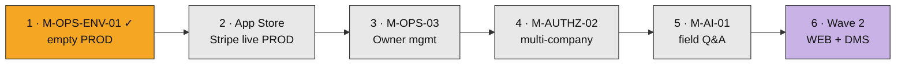
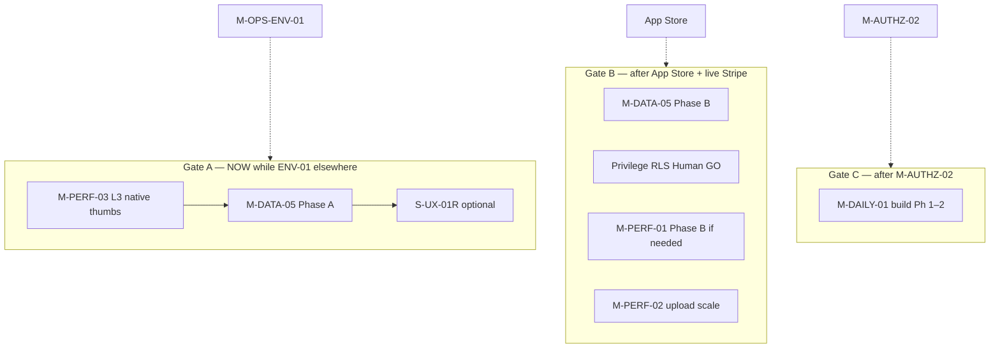
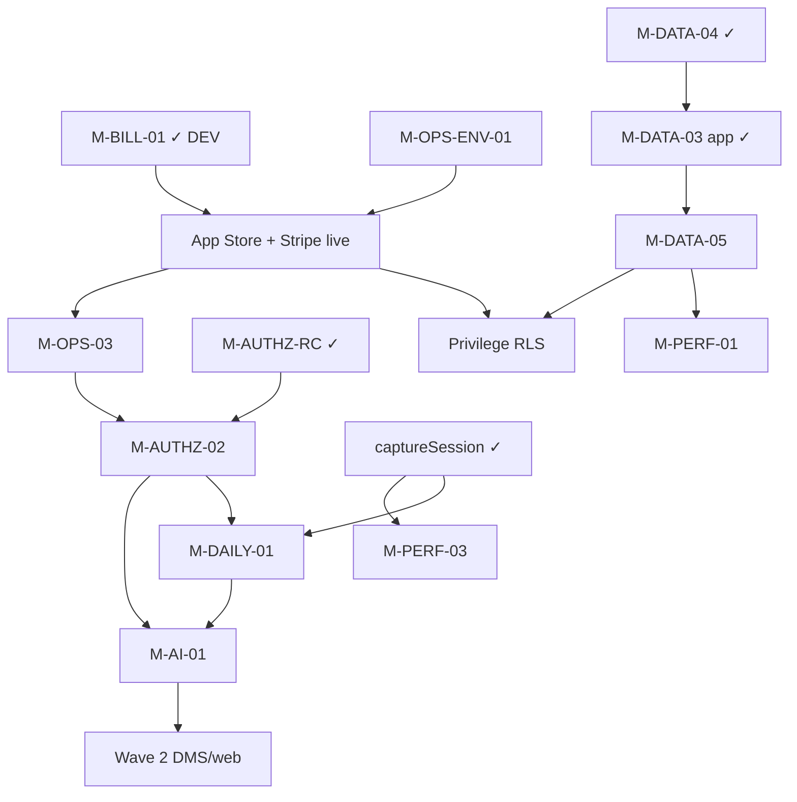

# Roadmap (WS / M / S)

This document is the single canonical milestone inventory for the repository's WS/M/S execution queue.

**Start here for commercial path:** [§ Commercial sequence map](#commercial-sequence-map-visual-sot) (build order + idle gates + dependency graph). Full ledger: [§ Milestone Inventory](#milestone-inventory).

## Taxonomy

- `WS` = Workstream
- `M` = Milestone
- `S` = Slice (milestone subdivision when needed)

## Status Rules

- `Closed`: milestone is complete and should be skipped unless a real regression forces reopening.
- `Pipeline`: milestone is pending execution.
- `Deferred`: explicitly out of the near-term queue; do not execute unless promoted back into `Pipeline`.

## Commercial sequence map (visual SoT)

**Purpose:** one glance at *build order* and *how ideas depend on each other*. Inventory table below remains the ledger; this section is the **authoritative commercial path + idle gates**. Snapshot **2026-08-29**. Session pick-up still lives in `./NOW.md`.

**Interactive companion (local Cursor canvas, not git):** open beside chat → `~/.cursor/projects/Volumes-KooDrive-InsiteApp/canvases/master-pipeline-consolidated.canvas.tsx`. When the canvas and this section disagree, **update both** — this file wins for agents/CI/docs.

### Build order (spine — do not jump)

**Foundation already Closed (feeds the spine):** `M-OPS-02`, `M-BILL-01` DEV MVP, `M-AUTHZ-RC`, `M-DATA-04`, `captureSession`.

### Idle-parallel gates (start only under the unlock)

| Gate | When | Start | Do not start |
| --- | --- | --- | --- |
| **A · NOW** | While `M-OPS-ENV-01` owned elsewhere | `M-PERF-03` (L3 idle-parallel) → `M-DATA-05` A → optional `S-UX-01R` | Secrets / PROD create / ENV plan edits |
| **B · Post-Store** | After App Store + Stripe live on PROD | `M-DATA-05` B · privilege RLS · `M-PERF-01` B if dogfood hurts · `M-PERF-02` | During ENV cutover week |
| **C · Post-AUTHZ** | After `M-AUTHZ-02` | `M-DAILY-01` Phases 1–2 (Phase 3 with `M-AI-01`) | Daily DDL before Human Gate |

**Frozen until product GO / later gate:** `M-CAPTURE-01` / `M-CAPTURE-02`, `M-BILL-F` / `M-BILL-01G`, `M-SEC-03`, `WS-STORAGE`, Wave 2 live DDL, privilege RLS **apply** during ENV-01, `M-AI-01` **build** before `M-AUTHZ-02`.

### How ideas connect (dependency, not calendar)

**Read:** solid arrows = unlocks / feeds. Cyan idle tracks hang off foundation or spine gates above — they must not reorder the orange commercial path.

### Cheat sheet

1. **#1 spine:** `M-OPS-ENV-01` (other chat may own cutover).
2. **#1 idle (this chat pattern):** `M-PERF-03` → then `M-DATA-05` Phase A.
3. **Next commercial:** App Store → Stripe live PROD → `M-OPS-03` → `M-AUTHZ-02` → `M-AI-01` → Wave 2.

## Milestone Inventory

| ID | Name | Status | Dependencies | Suggested Order | Primary References |
| --- | --- | --- | --- | --- | --- |
| WS-FND / M-FND-01 | Reliability & Data Integrity | Closed | None | - | ../AGENTS.md |
| WS-FND / M-FND-02 | Store Performance & Request Deduplication | Closed | M-FND-01 | - | ../AGENTS.md |
| WS-FND / M-FND-03 | Workspace Automation & Script Cleanup | Closed | M-FND-02 | - | ../AGENTS.md |
| WS-FND / M-FND-04 | UI Migration Foundations | Closed | M-FND-02 | - | ./m-fnd-04-ui-migration-wave-matrix.md |
| WS-DATA / M-DATA-01 | Cache authority & sync hardening | Closed | M-FND-02 | - | ../docs/superpowers/plans/2026-06-30-m-data-01-cache-authority-sync-hardening.md |
| WS-SEC / M-SEC-01 | Security & worktree sanitization | Closed | None | - | ../docs/superpowers/plans/2026-07-01-m-sec-01-security-worktree-sanitization.md |
| WS-SEC / M-SEC-02 | Credential rotation & secret-history remediation | Deferred | M-SEC-01 | - | ./BUG_INVENTORY.md |
| WS-SEC / M-SEC-03 | Single active mobile login per account | Deferred | Post commercial RC; Human Gate for Auth session policy | - | Logged 2026-08-25: one account → one active mobile session (new login revokes/displaces prior device). Not RC. Do not schedule ahead of M-AUTHZ-RC / M-BILL / M-AUTHZ-02. Dual-user Maestro (two accounts) remains valid. |
| WS-DATA / M-DATA-02 | Core model unification | Closed | M-DATA-01 | - | ../docs/superpowers/plans/2026-07-01-m-data-02-core-model-unification.md |
| WS-UI / M-UI-02 | Wave 2 UI migration & selector adoption | Closed | M-FND-04 | - | ../docs/superpowers/plans/2026-06-28-ws-roadmap-near-term-execution.md |
| WS-UI / M-UI-02 / S-UI-02A | ProjectsScreen migration | Closed | M-UI-02 | - | ../docs/superpowers/specs/2026-06-29-s-ui-02a-projects-screen-design.md |
| WS-UI / M-UI-02 / S-UI-02B | Group B header convergence | Closed | S-UI-02A | - | ../docs/superpowers/specs/2026-06-30-s-ui-02b-group-b-header-convergence-design.md |
| WS-UI / M-UI-02 / S-UI-02C | Photo update shortcut | Closed | S-UI-02B | - | ../docs/superpowers/specs/2026-06-30-s-ui-02c-photo-update-shortcut-design.md |
| WS-DEVEX / M-DEVEX-01 | Workspace loop & simulation tests | Closed | None | - | ../docs/superpowers/plans/2026-06-17-workspace-loop-and-simulation-tests.md |
| WS-AUTHZ / M-AUTHZ-01 | Role model normalization | Closed | None | - | ../docs/superpowers/plans/2026-06-20-role-model-normalization-plan.md; ./role-permission-matrix.md |
| WS-UI / M-UI-03 | Batch A | Closed | M-DATA-02, M-AUTHZ-01 | - | ../docs/superpowers/plans/2026-06-20-batch-a-auth-and-admin-screens.md |
| WS-UI / M-UI-04 | Batch B | Closed | M-DATA-02, M-AUTHZ-01 | - | ../docs/superpowers/plans/2026-06-20-batch-b-project-ops-screens.md |
| WS-UI / M-UI-05 | Batch C | Closed | M-DATA-02, M-AUTHZ-01 | - | ../docs/superpowers/plans/2026-06-20-batch-c-utility-and-admin-tail-screens.md |
| WS-UI / M-UI-06 | Photo screens modernization remainder | Closed | M-UI-05 | - | ../docs/superpowers/plans/2026-06-19-photo-screens-modernization.md |
| WS-UI / M-UI-07 | CreateTaskScreen full modernization completion | Closed | M-UI-06 | - | ../docs/superpowers/plans/2026-06-20-create-task-modernization.md |
| WS-UIA / M-UIA-01 | P0 contract safety, navigation hardening & adapter contract alignment | Closed | M-UI-07, M-DATA-02 | 8 | ../docs/superpowers/plans/2026-07-02-ws-uia-01-03-execution-plan.md |
| WS-UIA / M-UIA-02 | P1 portability, boundary cleanup & parallel-work separation | Closed | M-UIA-01 | 9 | ../docs/superpowers/plans/2026-07-02-ws-uia-01-03-execution-plan.md; ./UI_ARCHITECTURE.md |
| WS-UIA / M-UIA-03 | P2 render performance hotspots | Closed | M-UIA-02 | 10 | ../docs/superpowers/plans/2026-07-02-ws-uia-01-03-execution-plan.md |
| WS-QA / M-QA-01 | User testing rubric execution — 4 scenarios (A: rejection loop 4 shots, B: overdue crunch 3, C: isolation wall 3, D: iPhone 17 viewport 8) = 18 PNGs, suite rc=0, semantic PASS, driver attempt=1 each | Closed | M-UI-07 | 11 | ../docs/superpowers/plans/sprint7-user-testing-rubric.md; ../docs/superpowers/plans/2026-07-01-m-qa-01-user-testing-rubric-execution.md |
  - Closed evidence: 2026-08-06 live suite run via `scripts/maestro/run-qa01-suite.sh` against iPhone 17 Pro Max UDID B7B2640C-4738-4F8A-AEEE-5DF3D21D2533, com.buildtrack.app.local, Metro=http://127.0.0.1:8081
  - Artifacts (18 PNGs + run-summary.txt): `.cache/maestro-artifacts/qa01-20260806_214425/`  (A:4 / B:3 / C:3 / D:8)
  - Per-scenario PASS, attempts=1 (no driver reinstall/5999), A:157s B:75s C:105s D:85s, total ≈422s, SUITE ROLLUP rc=0, semantic shot-check found=needed 4/4 3/3 3/3 8/8
| WS-QA / M-QA-02 | UI automation foundation (root Maestro smoke + Sprint 7 bootstrap surface shipped) | Closed | M-UI-07 | 12 | ../docs/superpowers/plans/2026-07-01-ws-qa-02-ui-automation-maestro.md; ../docs/superpowers/specs/2026-07-01-maestro-local-setup-design.md; ./MAESTRO_LOCAL_SETUP.md |
  - Closed evidence: 2026-08-06 live re-verified suite run via `scripts/maestro/run-local.sh` against iPhone 17 Pro Max UDID B7B2640C-4738-4F8A-AEEE-5DF3D21D2533, com.buildtrack.app.local, Metro=http://127.0.0.1:8081, MAESTRO_LOCAL_HOME=project-local `.cache/maestro-home`
  - Foundation artifacts 3/3 flows rc=0 PASS (M-QA-02 deliverable): `launch-smoke.yaml` 13s, `sprint7-open-developer-settings.yaml` 30s, `sprint7-initialize-sandbox.yaml` 33s (includes bootstrap clearState:true + reseed)
  - Package scripts delivered: `test:e2e:maestro:install`, `test:e2e:maestro:final`, `validate:local:confidence`, `validate:local:maestro` (final = confidence + maestro:journeys, matches slow confidence table)
  - Wrapper conventions preserved: `run-local.sh` 10s ALIVE heartbeat lines, PHASE pre/post, no silent `|| true`, FINAL rc/elapsed lines
  - Artifacts root: `.cache/maestro-artifacts/d7-qa-20260806_234727/summary.txt` (M-QA-02 3 flows PASS); runbook: `documentation/MAESTRO_LOCAL_SETUP.md`
| WS-QA / M-QA-03 | Automated confidence & end-to-end UX coverage (active hybrid confidence expansion) — foundation shipped, S-UX-01I 18 gap-catalog testIDs applied, L3 Maestro 5/5 flows rc=0 full close | Closed | M-QA-02, S-UX-01I | 12.5 | ../docs/superpowers/plans/2026-08-01-ws-qa-03-automated-confidence-and-e2e-coverage.md; ../TESTING_STRATEGY.md; ../maestro/TESTID_GAPS_TODO.md; archive close: ../docs/superpowers/reports/2026-08-27-m-qa-03-worktree-archive-close.md |
  - Foundation delivered 2026-08-06: L1 Jest journeys 5 suites (6 tests) PASS, L2 regression 35/151 PASS, L2 components 7/32 PASS, L2 tsc-noEmit rc=0, M-QA-02 foundation 3/3 rc=0 PASS (cross-requirement)
  - S-UX-01I unlock (2026-08-07 commit 145282e): 18 TESTID_GAPS_TODO.md gap-catalog testIDs shipped in src/screens/* (last allowed screen.tsx edit window before milestone close). Hotfix commit 998948f repaired 5 Jest suites broken by testID rename (CreateTask double-id wrap create-task__field_title--preview + original createTask-title).
  - L3 Maestro 5/5 flows rc=0 PASS (2026-08-07, iPhone 17 Pro Max UDID B7B2640C-4738-4F8A-AEEE-5DF3D21D2533 iOS 26.0, com.buildtrack.app.local dev-client, Metro=http://127.0.0.1:8081, MAESTRO_LOCAL_HOME=.cache/maestro-home, run-local.sh wrapper FINISHED rc=0 all 5):
    (1) launch-smoke 72s (flow 1)  (2) sprint7-open-developer-settings 73s (flow 2)  (3) sprint7-initialize-sandbox 74s (flow 3, reseed Sprint7 preset A)  (4) journey-login-switch-projects 166s (flow 4, includes conditional login fallback + 1-switch Project B id tap)  (5) journey-projectswitch-create-taskdetail-update 74s (flow 5, includes conditional login fallback + 1-switch Project A id tap + direct camera-button create bypass). Execution order: flow 4 FIRST (performs login from any auth state → populates session → flows 1/2/3 work without login fallback).
  - L3 Maestro commits on master (0 prod edits, YAML + test-only):
    f722314 chore(maestro): swap 2 L3 journey YAML selectors text→id;
    70171a6 fix(maestro): correct seeded projectIds in 2 L3 journey YAMLs (Sprint7 preset A);
    a552eba fix(maestro): scrollUntilVisible before each project-picker row tap (viewport flake);
    6d044b5 fix(maestro): SQLSTATE 22P02 recovery + 1-switch per-flow + tasks gate.
  - Selector contract (P0 surfaces 0 text/regex except formally documented exemptions): ALL id-based — project-picker rows A/B (project-picker__row-sprint7-project-* ids), profile-menu-project_picker id, app-screen-header__profile-trigger id, app-screen-header__back id, create-task__field_title--preview id, task-detail__header_title id, update-progress__screen_title id, update-progress__description--preview id, root-tab__camera_button id.
  - Exemptions (inline-documented in YAML headers + TESTID_GAPS_TODO.md rows): 1× EXEMPT DYNAMIC (task row UUID tap regex content-match ${".*" + output.taskTitle + ".*"} → Date.now unique title → unique → no drift risk; row 17); 5× PLATFORM_LIMITATION native Alert.alert taps (RN Alert chrome has no RN testID prop; rows 21-24 + post-select error OK = row 24 category): (a) SQLSTATE 22P02 Error→OK, (b) photo picker sheet Cancel + title, (c) progress success body+OK.
  - SQLSTATE 22P02 handling (0 prod edits, pure YAML recovery): Sprint7 preset seeds user.id as slug "sprint7-user-tristan" not UUID matching live PG project_user_assignments.user_id column. handleSelectProject calls fetchUserProjectAssignments(user.id) → throws SQLSTATE 22P02 → catch shows native Alert and skips onNavigateBack. Recovery YAML pattern: when: visible id: projectPicker-scroll (stuck) → tap Alert OK text (PLATFORM_LIMITATION) → tap app-screen-header__back → dashboard. Cache invalidation workaround: 4-switch/2-switch/3-switch pattern → 1 switch per flow (pre-first-error rows still exist). Across flow 4 (B row id) + flow 5 (A row id) BOTH row ids still hit with id selectors.
  - Journey flow 5 tasks-screen gate fix (0 prod edits, pure YAML): root-tab__tasks_pressable gating (tasks-screen__task_list FAIL on empty project after switch, tasks-screen__search_section FAIL when slug→UUID assignment errors block data renders) → replaced with direct root-tab__camera_button tap (floating create button reachable from ANY tab, opens CreateTaskScreen stack independent of Tasks-tab data readiness; post-create success navigates to Tasks list with new task already in Zustand in-memory store, so task search + row tap still work).
  - Artifacts: L3 Maestro step screens hierarchies + screenshots under .cache/maestro-home/.maestro/tests/ (2026-08-07 runs: 102309 flow4, 102556 flow5, 102709 flow1, 102821 flow2, 102935 flow3); L1/L2 summary: .cache/test-engineering/d6-20260806_232101/summary.txt.
| WS-SUPABASE / M-SUPABASE-01 | Full Supabase deep-dive inspection | Closed (2026-08-07) | M-DATA-02 | 13 | Evidence: `audit/database/2026-08-07-msupabase01-system-coupling-map.md` (5 stores + Realtime coupling), `audit/database/2026-08-07-msupabase01-inspection-report.md` (§1–§4 4-domain report), `audit/database/2026-08-07-msupabase01-findings-backlog.md` (11 entries P0/P1/P2 = 2/6/3). Live-SQL audit: skipped; code-path only (no ~/.pgpass). Plan ref: `../docs/superpowers/plans/2026-07-01-ws-supabase-01-deep-dive-inspection.md`. |
| WS-SUPABASE / M-SUPABASE-02a | RLS hardening 7-table anon-block (P0 Security) | Closed (2026-08-08) | M-SUPABASE-01 Closed | 13.1 | Gate 1 Option A live-SQL 7/7 redacted appendix: `docs/superpowers/evidence/m-supabase-02a-02b-gate1-redacted-20260808.md`. Pre-fix anon SELECT leaked rows on 6/7 tables (project_locations already 0). Applied `supabase/migrations/20260808000100_msupabase02a_anon_block_seven_tables.sql` live: REVOKE ALL FROM anon + ENABLE RLS + restrictive `anon_block_all` on companies/users/projects/tasks/task_activities/task_read_status/project_locations; interim authenticated policies where helpers absent. Close proof: anon SELECT → permission_denied on all 7. Close report: `docs/superpowers/reports/2026-08-08-m-supabase-02a-02b-close.md`. |
| WS-SUPABASE / M-SUPABASE-02b | public.users.id FK integrity + users_self_write INSERT policy (P0 Integrity) | Closed (2026-08-08) | M-SUPABASE-01 (parallel ok with 02a; shares Gate 1 live-SQL) | 13.2 | Gate 1 confirmed `users.id → auth.users` FK absent. Applied `supabase/migrations/20260808000200_msupabase02b_users_fk_and_self_write.sql` live: `users_id_fkey_auth_users` FK ON DELETE CASCADE **NOT VALID** (VALIDATE deferred); policy `users_self_write` INSERT TO authenticated WITH CHECK (id = auth.uid()). Signup parity harness N/A this cycle (no matching parity test). Evidence + report same as 02a. |
| WS-SUPABASE / M-SUPABASE-03a | Role column integrity CHECK constraint (P1) | Closed (2026-08-10) | M-SUPABASE-02a (RLS baseline first) | 13.3 | Human GO + Phase B live apply on pooler session `:5432`. Dropped legacy `users_role_check`; normalized `manager`→`supervisor` (3); added `users_role_allowed_values` + `upa_category_allowed_values`; dual-path helpers + `users_guard_role_column_writes`. Invalid role → check_violation; anon deny 7/7. Close: `docs/superpowers/reports/2026-08-10-m-supabase-03a-close.md`. |
| WS-SUPABASE / M-SUPABASE-03b | Tasks redesign metadata 6-column migration + cross-tenant backfill (P1 — hard prereq for S-UX-01J/K/M/N) | Closed (2026-08-08) | M-SUPABASE-02a + M-SUPABASE-02b Closed (confirmed live baseline gate before any schema edit) | 13.4 | **_ROLLOUT WARNING:_ satisfied — Phase A artefacts + Human GO + Phase B live apply.** 6-col: `primary_assignee_id, delegated_user_ids, container_id, sub_container_id, tags, location_on_site` ensured as **text/text[]** (Decision D1). Migration `20260808000300_msupabase03b_tasks_6col_metadata.sql` applied production session `:5432` rc=0; backfill primary from `assigned_to[1]` → 89/97; indexes present; anon SELECT still permission_denied all 7 (02a intact). Phase A checklist: `docs/superpowers/reports/2026-08-08-m-supabase-03b-phase-a-schema-review.md`. Close: `docs/superpowers/reports/2026-08-08-m-supabase-03b-close.md`. UUID upgrade (D2) + containers table (D3) deferred.
| WS-SUPABASE / M-SUPABASE-03c | Storage bucket buildtrack-files policy + public/signed URL decision (P1) | Closed (2026-08-10) | M-SUPABASE-01 Closed (parallel ok) | 13.5 | Human GO + Phase B: `buildtrack-files.public` flipped **true→false** (D1 private). Object policies remain authenticated-only (6). **D2 signed-URL cutover shipped (2026-08-10):** `fileUploadService` uses `createSignedUrl` (TTL 3600s) + adapter cache re-sign for legacy public URLs. Close: `docs/superpowers/reports/2026-08-10-m-supabase-03c-close.md`. Artefact: `20260809000200_msupabase03c_storage_bucket_policy.sql`. |
| WS-SUPABASE / M-SUPABASE-03d | Deferred-schema compat fallback observability + fire-rate metric (P1) | Closed (2026-08-09) app-side | M-SUPABASE-01 Closed (parallel ok) | 13.6 | App-side structured observability: `src/api/deferredSchemaObservability.ts` — in-process counters + `[deferred_schema_fallback]` JSON warn lines; wired into createTask/updateTask deferred-compat paths in `taskStore.supabase.ts`. Postgres audit table deferred (optional later). Success metric remains fire-rate → 0 on migrated tenants. |
| WS-SUPABASE / M-SUPABASE-03e | Service-role script dry-run gating (P1 ops safety) | Closed (2026-08-09) | M-SUPABASE-01 Closed (parallel ok) | 13.7 | Default dry-run on `rebuild_auth_users_from_users.js` + `fix_missing_user_record.js`; writes only with `--apply`. Pre-write diff printouts; `--dry-run`/`--check-only` force dry-run. |
| WS-SUPABASE / M-SUPABASE-04a | Realtime postgres_changes publication membership audit + reconnect loop (P2 freshness) | Closed (2026-08-10) | M-SUPABASE-02a (Gate 1 pg_publication_tables step shared) | 13.8 | **App:** exponential backoff + AppState soft resubscribe (`5d7b4e4`). **Human GO + Phase B:** `ALTER PUBLICATION supabase_realtime ADD TABLE` tasks/task_activities/projects/users on session `:5432` → post-apply audit **4/4**. Pre-apply 0/4 evidence retained; post-apply: `docs/superpowers/evidence/m-supabase-04a-publication-membership-post-apply-redacted-20260810.md`. Migration SoT: `20260810000200_msupabase04a_publication_add_tables.sql`. Close: `docs/superpowers/reports/2026-08-10-m-supabase-04a-close.md`. Replica identity left `default`. |
| WS-SUPABASE / M-SUPABASE-04b | Legacy task status dual-path deprecation cleanup (P2 hygiene) | Pipeline — **blocked until ~2026-09-07** (30d cool-down post 03b) | M-SUPABASE-03b + 30-day cool-down post migration | 13.9 | **Cool-down:** M-SUPABASE-03b live apply 2026-08-08 → earliest drop window **~2026-09-07**. Do **not** DROP legacy status columns before that date. After cool-down: drop legacy status columns (current_status legacy accepted/accepted_at/ready_for_review/reviewed_by/reviewed_at/review_accepted/rejected_reason + declined_reason) per TASK_STATUS_UNIFIED_MIGRATION.sql lines 93–97; remove taskStore dual-write branches; simplify updateTask. tsc + L2 regression PASS is close gate. |
| WS-SUPABASE / M-SUPABASE-04c | Storage bucket retention / lifecycle policy (P2 cost hygiene) | Closed (2026-08-13) — docs/policy only | M-SUPABASE-03c Closed | 13.10 | **Docs/policy close — no live Dashboard Expire, no bucket-wide expire, no SQL migrations.** Paying tenants keep files indefinitely on hot `buildtrack-files`. After plan expiry, restore = **back-pay up to 6 months** (objects stay on hot storage in that window). Hosted Storage can hot-retain or optionally expire/delete; 04c uses **hot retain only**. Cold archive / Glacier / copy-out / cheap tier = **not 04c** (parked as M-SUPABASE-04e). Evidence: `audit/database/SUPABASE_OPERATIONS_RUNBOOK.md` § Storage retention (04c) + this Notes cell + `docs/superpowers/reports/2026-08-13-m-supabase-04c-close.md`. |
| WS-SUPABASE / M-SUPABASE-04d | Index health pass (task_read_status composite + project_locations) (P2 perf) | Closed (2026-08-10) | M-SUPABASE-02a (Gate 1 pg_stat_user_indexes step shared) | 13.11 | Human GO + Phase B live apply on pooler session `:5432`. `CREATE INDEX CONCURRENTLY IF NOT EXISTS`: `idx_task_read_status_user_task` **created**; `idx_project_locations_project_id` already present (no-op). Post-apply `pg_indexes` **2/2**; both valid/ready. Artefact: `20260810000100_msupabase04d_index_health.sql`. Close: `docs/superpowers/reports/2026-08-10-m-supabase-04d-close.md`. |
| WS-UX / M-UX-01 / S-UX-01J | Tags + Primary Assignee editor + CriticalThisWeek tag persistence | Closed (2026-08-08) | M-SUPABASE-03b Closed (6-col migration applied all tenants first) | 13.12 | Writes `tags text[]` + `primary_assignee_id text` (live D1 types). Create/Edit persist primary + tags; Task Detail Tags & Primary editor; Critical this week toggle persists `critical_this_week`. Helpers: `src/ui/contracts/taskTags.ts`. No containers DDL.
| WS-UX / M-UX-01 / S-UX-01K | Task Delegation Panel (multi-user picker) | Closed (2026-08-08) | M-SUPABASE-03b Closed | 13.13 | Writes `delegated_user_ids text[]` (live D1). Create/Edit: non-primary selected users persist as delegates; Task Detail toggles delegates among assignees; `assigned_to` = primary ∪ delegates. Helpers: `src/ui/contracts/taskDelegation.ts`. Reuses project-member pool + `assigneesLocked`. **Who→whom rules deferred to S-UX-01K2.** |
| WS-UX / M-UX-01 / S-UX-01M | Create Task Location Refinement (location_on_site picker) | Closed (2026-08-08) | M-SUPABASE-03b Closed | 13.14 | UI shipped earlier (`03627be` / CreateTask project_locations picker + `locationOnSite`). Post-03b close: column persists as `location_on_site text`; Create/Edit + Task Detail site editor write dedicated task field (not project.address); `ensureProjectLocation` seeds shared options. Verified tsc + location Jest suites PASS. |
| WS-UX / M-UX-01 / S-UX-01N | Container Model (container_id/sub_container_id FK + containers table) | Closed (2026-08-08) | M-SUPABASE-03b Closed | 13.15 | Live `project_containers` + assignment RLS + anon_block_all. Forward `20260808110000_…` + RLS fixup `20260808110002_…`. Progressive Create disclosure; text `container_id`/`sub_container_id`. Close: `docs/superpowers/reports/2026-08-08-s-ux-01n-close.md`. GO phrase recorded in chat. |
| WS-UX / M-UX-01 / S-UX-01K2 | Task delegation permission / who→whom rules | Closed (2026-08-09) Phase B | S-UX-01K Closed | 13.16 | **Phase A (app-only):** edit = task creator + unlocked status; select = active project members (or current assignees on Detail). **Phase B (who→whom):** `canSelectAssignee` + `ASSIGNEE_PRIVILEGE_RANK` — actor may select candidate iff privilege(actor) ≥ privilege(candidate). Ranks: admin/company_admin (40) > manager/supervisor (30) > foreman (20) > member/worker (10). Wired Create picker filter + Detail `setPrimaryAssignee`/`toggleDelegate` guards. **Assumption (no product matrix table):** docs lack explicit who→whom; privilege defaults mirror SystemPermission + M-SUPABASE-03a role vocabulary. RLS deferred. Helper: `src/ui/contracts/taskDelegationPermissions.ts`. |
| WS-UX / M-UX-01 / S-UX-01P | Unified typeahead for catalogue input fields (historical partial match) | Pipeline (deferred improvement — not active focus) | S-UX-01N Closed | 13.17 | **Deferred UX hygiene — do not schedule ahead of 03a/03c GO or M-04a–d.** Scope: CreateTask (and similar) search/input fields — location on site, Area/containers, and other catalogue-backed inputs — share one autocomplete behavior: as the user types, show partial-match suggestions from project historical values for that field; add-new when no match. Not a fat-finger / tap-target pass — suggestion-list sync only. |
| WS-SUPABASE / M-SUPABASE-04e | Operator-owned cold archive: copy-out then delete hot copies (P2 cost) | Pipeline (deferred — not active focus) | M-SUPABASE-04c Closed | 13.18 | Copy objects from hot `buildtrack-files` to **operator-owned** cheap/cold storage, then delete hot copies. Restore after back-pay = copy back to hot. **Hosted Supabase cannot Glacier / lifecycle-transition** (`PutBucketLifecycleConfiguration` unsupported; no `x-amz-storage-class`). Prereq 04c Closed. Do not schedule ahead of **04b** (~2026-09-07 SQL cool-down); idle-parallel only after 04b is gated. |
| WS-UX / M-UX-01 / S-UX-01Q | UI/UX consistency + nested layout hygiene (P0-first) | Pipeline (P0 landed 2026-08-14; upload Phase 1+2 Draw closed 2026-08-15; **Phase C track C1 landed 2026-08-16**) | S-UX-01I Closed | 13.19 | Audit: `../docs/superpowers/analysis/2026-08-14-ui-ux-consistency-audit.md`. **P0 landed:** orphan deletes; headers/`PrimaryActionBar` SafeArea; flatten shells. **2026-08-15 upload UX closed (Phase 1+2):** in-app library Option A; Select Photos light edit + Draw (Skia). **Phase C C1 (2026-08-16):** Projects/ProjectDetail/Profile/auth/admin shells → `ModernScreenHeader` + `#E7F4F8` + teal chrome. **Phase C C4 (2026-08-16):** sole row SoT `ActivityStyleRowCard`; removed legacy Dashboard/Tasks screens, `TaskCard`, orphan `ProjectsTasksScreen`, uiMode toggle. **Visual path B (2026-08-16):** critical/activity/task recipes + photo-first Critical Tasks; path C photo-centric IA post-release. **Phase C C2+C3 (2026-08-16):** TextField on Login/ProjectForm/CreateTask primary fields; retired CreateTask `TaskActionScreen` → UpdateProgress/AddComment/ReassignTask (plan `../docs/superpowers/plans/2026-08-16-s-ux-01q-phase-c-plan.md`). **C5 Closed (2026-08-17):** Insite=company, Taskr=app — rename N/A; opt attribution + Tailwind tokens tabled. **Still deferred:** C6/S-UX-01P; Option B gallery; Phase 3 caption. **IMGLY uninstall:** see **S-UX-01Q2**. |
| WS-UX / M-UX-01 / S-UX-01Q2 | Uninstall IMGLY + remove dead PhotoAnnotation route | Closed (2026-08-15) | S-UX-01Q Phase 2 Draw Closed | 13.20 | Dead path: no navigators called `PhotoAnnotation` after Select Photos Draw shipped. Removed `@imgly/editor-react-native`, `PhotoAnnotationScreen` / `usePhotoAnnotationViewAdapter`, stack routes + params, img.ly Android Maven repo, `useFrameworks: static`, and EAS IMGLY LICENSE.md pod patch. Photo edit SoT remains Select Photos (rotate/crop/draw → `annotatedUri`). Kept `ios.buildReactNativeFromSource=true` for Skia until a follow-up rebuild proves it optional without static frameworks. Tradeoff accepted: no IMGLY text/stickers; pen-only draw. **Requires native rebuild** (`npx expo run:ios` / EAS) after pod refresh. |
| WS-DMS / M-DMS-00 | DMS infrastructure investigation + backend decision | Closed (2026-08-17) — docs; **Wave 2 kickoff** | Product spec 2026-08-06 | 15.0 | **Wave 2** (after first commercial ship — not week-rank R2/RC). **Decision: stay on Supabase** for document register (Postgres) + blobs (`buildtrack-documents`). No second document DB for Phase 2. Evidence: `../docs/superpowers/analysis/2026-08-17-dms-infrastructure-investigation.md`. Spec: `../docs/superpowers/specs/2026-08-06-web-admin-and-dms-product-spec.md`. Alternatives (R2/S3 blobs-only, external search) deferred until cost/scale evidence. |
| WS-OPS / M-OPS-01 | Platform owner command console | **v1 Closed (2026-08-22)** — in-app bootstrap only | First commercial RC shipped | 15.05 | **Owner-only** (Tristan). **v1 (Taskr mobile):** Profile → Owner Console shell; Monitoring/Economics/Tenant stubs; Gaps + F-003 session. **Bootstrap only — do not grow owner admin inside Taskr.** **Target (locked 2026-08-24):** dedicated **Owner management interface** → **M-OPS-03**. v2+ KPI RPC, tenant writes, economics = M-OPS-03 app+web / Edge — not field app Profile. SoT: `../docs/superpowers/plans/2026-08-22-owner-console-modules-complete.md`, `../docs/superpowers/plans/2026-08-22-owner-monitoring-architecture.md`. Billing↔access = **M-BILL-01**. |
| WS-OPS / M-OPS-ENV-01 | Prod vs Dev Supabase split (empty PROD project) | **Closed (2026-08-29)** — Phases A–C | Before App Store / production TestFlight dogfood | 14.94 | **Closed:** PROD `insite-prod` / `jcnzjigxgkzhjsaekoqz` empty + migrations + Edge; DEV remains `insite-dev` / `zusulknbhaumougqckec`. EAS: **`dev`**/`preview`→preview(DEV); **`production`**→production(PROD). Daily TF: `./build-and-submit.sh ios` (profile `dev`). Deploy scripts require `--project-ref`. Promotion SoT: `./PROD_DEV_PROMOTION.md`. Plan: `../docs/superpowers/plans/2026-08-26-prod-dev-supabase-split.md`. **Not in this close:** Stripe `sk_live` / live catalog (App Store submit = Phase D). |
| WS-OPS / M-OPS-03 | **Owner management interface** (platform operator app + web) | Pipeline — **Phase 1a–1d 2026-08-30** (1b owners + Economics + 1d writes) | M-OPS-01 v1 Closed; M-BILL-01 MVP | 15.059 | **Locked 2026-08-24; naming 2026-08-26; distribution 2026-08-30:** dedicated operator **app + web `/owner/*`** (one IA), never mixed with field Taskr. **iOS: Internal TestFlight only** — bundle `com.insite.hq`, display **hq**, path `apps/owner/` — **never App Store listing, never External/Public TF**. ASC `6806629041`. **Phase 0 smoke:** TF build **2** login `tristan@insitetech.co` PASS. **Phase 1a:** Edge `owner-kpi-snapshot`. **Phase 1b:** `platform_owners` + `is_platform_owner` on DEV. **Phase 1c:** `owner-tenant-read`. **Economics:** `owner-economics-snapshot` counts (no invented $). **Phase 1d:** `owner-tenant-write` create/deactivate + audit + Auth ban. Out: §3e purge, plan overrides, desk web. Same Supabase; **no service-role in client**. **Not** M-WEB-01. SoT: `../docs/superpowers/plans/2026-08-22-owner-console-modules-complete.md` + `../docs/superpowers/plans/2026-08-30-m-ops-03-owner-internal-tf-kickoff.md`. |
| WS-BILL / M-BILL-01 | Commercial E2E: Stripe → entitlements → seat enforcement | **Closed (2026-08-27) — DEV MVP** | M-OPS-02 MVP; Human Gate before live schema/webhook | 15.048 | **DEV MVP closed:** HKD catalog UI + Checkout + Extra people +1 + invite caps PASS. Close: `../docs/superpowers/reports/2026-08-27-m-bill-01-close.md`. **HK lock:** Starter HK$160 / Pro HK$400 + add-ons; charge **HKD only**. **Polish:** stripe-webhook RPC destructure (empty meters wipe). **2026-08-27:** CA→worker live on DEV; `on_hold` CHECK drop **dormant**. SoT: `../docs/superpowers/plans/2026-08-24-billing-hkd-pricing-lock.md`. Out of MVP / still parked: hard project/upload gates (**M-BILL-F**); FX display (**M-BILL-01G**); PROD/live Stripe (after **M-OPS-ENV-01** + App Store). |
| WS-BILL / M-BILL-01G | Display-only FX (view other currencies; charge HKD) | Pipeline — **tabled** (next billing slice after HKD MVP) | M-BILL-01 HKD MVP | 15.049 | **Tabled 2026-08-24.** Show approximate USD/EUR/etc. under HKD list price for viewing only. **Charge stays HKD** via Stripe Checkout. **No** per-country VAT/GST/sales-tax collection; **no** tax-inclusive local Prices; **no** Stripe Tax until accountant GO. Label estimates as approximate. Does not block AUTHZ-02 / RC smoke. |
| WS-OPS / M-OPS-02 | Core-loop tightness: shrink hot files + enforce status machine | **Closed (2026-08-22)** — OPS02-A/B/C/D | M-OPS-01 v1 | 15.06 | Create/update validation guards, local drafts (7d TTL), WIP reconcile, hot-file extracts (`taskDerivedState`, `taskNormalization`, `taskDeferredSchemaCompat`, `taskStore.selectors`, AppNavigator nav helpers), draft discard + swipe-back. Evidence: kickoff `../docs/superpowers/plans/2026-08-22-m-ops-02-kickoff.md`; commit `e3eeb6d`; OPS02-D Jest `test:tasks` 38/38 + ops subset 111/111 PASS. |
| WS-AUTHZ / M-AUTHZ-RC | Host-company user / project / assignment contract | **Closed (2026-08-27)** — H01–H08 headed PASS | First commercial RC | 14.96 | **Construct GO 2026-08-24:** CA / PM / Worker seats; **PA** = project grant crownable on CA\|PM only (never worker); same field UI + CA management via avatar; CA sees project KPIs not all tasks; drop trade title picker; CA may take job authority via PA. SoT: `../docs/superpowers/plans/2026-08-24-company-user-project-model.md`. **Not** liaison/invite/absorb (**M-AUTHZ-02**). **2026-08-26:** Phases A–C + catch-up (PA roster gate, Member/PA labels, dead ProjectRole picker stripped, avatar → Company management). **Close:** headed H01–H08 PASS; report `../docs/superpowers/reports/2026-08-27-m-authz-rc-close.md`. |
| WS-AUTHZ / M-AUTHZ-02 | Multi-company project membership (liaison + project invite + host-absorb seats) | Pipeline — **post-RC** (not this ship) | M-OPS-02; Human Gate before invite/RLS DDL | 15.065 | **Locked 2026-08-21.** Product SoT: `./multi-company-project-membership.md`. Three paths: (A) host appoints partner **liaison** who manages same-company roster on that project; (B) project-scoped invite URL — guest stays on **their** company seats; (C) host **explicitly** absorbs outsider onto **host** seats. Pricing: each company owns its employees by default; company admin ≠ project authority; company admin gets **knowledge** of who of theirs is on which projects (incl. outbound). No global user directory. Distinct from company seat invite (`inviteCompanyUser`). Host-company assignment consistency is **M-AUTHZ-RC**, not a slice of this milestone. Clarification addendum: `../docs/superpowers/analysis/2026-08-19-roadmap-clarification.md`. |
| WS-DATA / M-DATA-03 | Pull-to-refresh & sync resilience (session-gated fetch, retry, honest empty states) | Pipeline — **app-side landed 2026-08-20**; deeper visibility hardening deferred post-RC | First commercial RC | 15.055 | **2026-08-20:** session-gated `triggerRefresh` + one retry; poll uses cache (`fetchTasks(false)`); `task_activities` scoped to fetched task IDs; `reconcileFetchedTasks` keeps object identity; Tasks empty copy distinguishes load error. **Not closed:** broader visibility hardening remains post-RC. **M-DATA-04 Closed 2026-08-27** (was prior RC blocker). Remaining list-bandwidth / logout GC → **M-DATA-05**. Evidence: `../docs/superpowers/analysis/2026-08-19-photo-sync-resilience-investigation.md`. |
| WS-DATA / M-DATA-05 | Client cache hygiene & bandwidth (folded multi-LLM recs) | Pipeline — **Phase A landed 2026-08-29**; B/C remain | M-DATA-01 Closed; M-DATA-03 app-side; M-DATA-04 Closed | 15.0551 | **Opened 2026-08-27** from caching deep-dive + multi-LLM fold. **Does not block** commercial sequence (`M-OPS-ENV-01` / BILL / App Store). **Phase A (landed):** list fetch without full activity history; stop always-force project/assignment polls; kill SWR→`force` loop; reconcile keeps hydrated timeline. **Phase B:** logout/identity clear (coordinator, signed URLs, batches, upload-failures, `draft-media/`); 5d batch prune write-path; one-shot delete legacy `buildtrack-tasks`. **Phase C (defer/measure):** project-scoped hot path; optional identity-bound slim disk index. Plan: `../docs/superpowers/plans/2026-08-27-m-data-05-cache-hygiene-action-plan.md`. Investigation canvas (local): `data-caching-policy`. |
| WS-DATA / M-DATA-04 | Realtime subscription / reconnect storm (compute + auth outage) | **Closed (2026-08-27)** | Before commercial RC | 14.95 | **Opened 2026-08-20.** App dampening + reconnect hygiene. **2026-08-21:** 30s idle PASS. **2026-08-27 close sample:** after `pg_stat_statements_reset`, `list_changes` ~218 calls / **~1.2 s** total (not 81k/486s); `with sub_tables` 28 calls; no INSERT subscription flood; REST tasks/activities/users single-digit. Airplane + 10‑min seq_scan re-proof waived by owner. Close: `../docs/superpowers/reports/2026-08-27-m-data-04-close.md`. Gate SQL: `../docs/superpowers/sql/2026-08-20-m-data-04-realtime-gate.md`. Investigation: `../docs/superpowers/analysis/2026-08-20-db-spike-realtime-churn.md`. |
| WS-PERF / M-PERF-01 | Evidence photo display performance (signed-URL + thumbnail cache) | Pipeline — **app-side landed 2026-08-20**; **Phase B tabled 2026-08-28** | M-SUPABASE-03c Closed | 15.056 | **2026-08-20 Phase A:** list/activity thumbs use `expo-image` `memory-disk` keyed by storage path; signed URLs persist in AsyncStorage (cap 200); prefetch Tasks visible rows + Dashboard selected project only. **Phase B tabled (priority TBD):** smaller remote thumb bytes (transform/`_thumb`), Tasks/Dashboard FlatList + viewport `prefetchSignedUrls`, lazy activity carousel, batch `createSignedUrls`, blurhash placeholders. Overlap with **M-PERF-03:** viewport-gating + skeleton UX patterns only — study: `../docs/superpowers/plans/2026-08-28-m-perf-03-library-picker-spike-plan.md` § M-PERF-01 overlap. **Not closed:** Maestro `_boot-no-clear` optional. Does **not** block RC. |
| WS-PERF / M-PERF-03 | Device photo library picker perf & progressive grid UX | Pipeline — **L3 first-screen proven TF 213**; **Photos index in TF 214 (headed: continuous yes, first-12 ~11s + jumpy scroll)** | captureSession Closed; TF200 hybrid lag fix | 15.0561 | **On-device Photos.** Shared `LibraryPhotoGrid` + FlatList (no FlashList v2). **E2E bar:** `../docs/superpowers/analysis/2026-08-29-instagram-class-picker-e2e.md`. **Done on device:** L1 HUD, L2 skeletons, **L3 native thumbs** (TF 213: first 12 ~69–240ms, `path native`). **TF 214 headed:** `meta/row/12 ~11420ms` then continuous fill; jumpy while scrolling. Cause: sync `openLibrary` + 3-col `getItemLayout`. Fix (async Recents + row list) → TF 215. Idle-parallel; does **not** block RC. |
| WS-FIELD / M-CAPTURE-01 | Camera zoom control | Pipeline — **tabled 2026-08-28** | captureSession Closed | 15.0562 | Pinch/slider zoom on the hybrid capture camera. **Do not plan or build now.** Idle-parallel later; must not jump `M-OPS-ENV-01`. |
| WS-UX / M-CAPTURE-02 | Library picker tile resize | Pipeline — **tabled 2026-08-28** | captureSession Closed | 15.0563 | User-resizable tiles in the hybrid photo picker grid. **Do not plan or build now.** Idle-parallel later; must not jump `M-OPS-ENV-01`. |
| WS-PERF / M-PERF-02 | Evidence photo upload downscaling (storage conservation) | Pipeline — **post-RC cost hygiene** (idle-parallel ok) | M-SUPABASE-03c Closed; M-PERF-01 app-side | 15.058 | **Opened 2026-08-24.** Downscale/compress task evidence photos **before** upload to `buildtrack-files` to slow tenant storage growth and align with plan-cap metering (**M-DMS-DATA**). **Today:** `src/api/imageCompressionService.ts` adapts JPEG quality toward a **5 MB file-size cap** and may shrink dimensions ~70% as a last resort — **not** a consistent max-edge / jobsite-legibility policy. **Scope:** define upload policy (max long edge, quality floor, HEIC→JPEG, orientation/EXIF, skip double-compress on draw bakes/edits); wire at upload SoT (`fileUploadService`, create/update progress paths). **Must not** degrade field inspection detail (fasteners, labels/barcode path for **M-AI-03**). Human Gate only if stored artifact contract changes. Does **not** block RC. |
| WS-UX / M-UX-01 / S-UX-01R | Retire Add Comment dead path (field narrative → Update Description) | Pipeline — **post-RC dead-code hygiene** (idle-parallel ok; pair with M-OPS-02 nav shrink) | First commercial RC | 15.057 | **Opened 2026-08-19.** W-D05 **Exempt** in MAINTABS — Task Detail no longer exposes `add_comment`; workers use Update Progress description (`W-D03` / `W-C07`). **Phase A:** delete `AddCommentScreen` + nav routes; route `actionType: comment` → UpdateProgress; strip `add_comment` adapter/screen wiring. **Phase B (defer):** `assigner_comment` DB/display + `addAssignerComment` until product confirms no assigner-only path. Plan: `../docs/superpowers/plans/2026-08-19-s-ux-01r-retire-add-comment-dead-path.md`. Evidence: `../docs/superpowers/evidence/2026-08-19-w-d05-gap-no-comment-chip.png`. Does **not** block RC. |
| WS-FIELD / M-DAILY-01 | Camera + voice memo → daily report → PM → AI corpus | Pipeline — **Phase 0 locked; build parked** | Prefer M-AUTHZ-02 before Phase 2; Phase 3 with M-AI-01; **captureSession Closed 2026-08-27** (Phase 1 host ready) | 15.065 | **2026-08-27 Phase 0:** Daily Report = **first-class project-day artifact** (not only task updates). Vision: `../docs/superpowers/analysis/2026-08-27-daily-capture-memo-vision.md`. Phases 1–3 kickoff: `../docs/superpowers/plans/2026-08-27-daily-report-phases-1-3-kickoff.md`. Capture host closed: `../docs/superpowers/reports/2026-08-27-capture-session-close.md`. **No live DDL / no daily-report build** until Human Gate + spine. |
| WS-AI / M-AI-01 | Field Q&A over project dataset | Pipeline — **planning gate before build** | M-BILL-01 MVP; M-AUTHZ-02 | 15.07 | **High-certainty only** (policy in `2026-08-19-post-rc-boring-loop.md`). On-site questions against this project’s tasks/photos/activity (**+ submitted daily reports when M-DAILY-01 Phase 2+ lands**). Cite or abstain. Create Task LLM is on-ramp only. Wrong-project = safety defect. **2026-08-24:** architecture + pricing/options captured in `../docs/superpowers/plans/2026-08-24-m-ai-01-query-gateway-planning-brief.md` — **no implementation GO** until planning checklist in that doc is complete. Provisional shape: Supabase read RPCs + Edge `ai-query` gateway + thin mobile client; optional dev MCP on same API; tier fair-use caps (not per-call SKU). Distinct from `MCP_HUB_ARCHITECTURE.md` (external platforms). Daily-report vision: `../docs/superpowers/analysis/2026-08-27-daily-capture-memo-vision.md`. |
| WS-AI / M-AI-02 | Drawing intelligence (PDF then CAD) | Pipeline — after document register | **M-DMS-01** (current revision); M-AI-01 | 15.08 | **High-certainty only:** title block, current-rev fetch, quote a **crop** with sheet+rev. Do **not** infer dimensions/geometry or treat 3D viz as truth. CAD via convert or specialist API. Superseded-rev answers = safety defect. Full-set inference stays out of scope. |
| WS-WEB / M-WEB-01 | Web admin shell + company users/projects | Pipeline — **Wave 2** | M-DMS-00 Closed; **M-OPS-01 + M-OPS-02** | 15.1 | **Wave 2 — do not start before post-RC sequence.** Login, layout, permission guards, `/a/users` + `/a/projects`. Canonical URL **https://app.insiteworks.co**. Plan: `../docs/superpowers/plans/2026-08-06-ws-web-01-and-02-web-admin-shell-and-project-workspace.md`. Shared auth/stores with mobile. |
| WS-WEB / M-WEB-02 | Project workspace shell | Pipeline — **Wave 2** | M-WEB-01 | 15.2 | **Wave 2.** `/p/:id` team, settings, project KPI widgets. Prereq for dogfooding DMS UI. |
| WS-DMS / M-DMS-01 | DMS core (schema + register + upload + revisions + audit) | Pipeline — **Wave 2** | M-WEB-02; Human Gate before live DDL | 15.3 | **Wave 2.** Tables: documents / revisions / folders / ACLs / audit. Bucket `buildtrack-documents` private + signed URLs + TUS for large files. Raise size cap above today’s 50 MB task-files limit. Service: `documentService.ts`. **Do not ship before schema Human GO.** **Storage portability (`WS-STORAGE`) may open only after this milestone starts** — design once across task evidence + documents. Slotting: `../docs/superpowers/plans/2026-08-21-customer-managed-storage-slotting.md`. |
| WS-STORAGE / M-STORAGE-01 | Customer-managed storage discovery + contract | Deferred — **not RC / not post-RC OPS** | `M-DMS-01` start; roadmap lock reopen | 15.31 | Enterprise/privacy track only. Define modes, portability promise, provider-neutral `blobRef`, legacy Supabase compatibility. **No implementation.** Must not jump RC, `M-OPS-01`, `M-OPS-02`, or `M-AI-01`. Plan: `../docs/superpowers/plans/2026-08-21-customer-managed-storage-slotting.md`. |
| WS-STORAGE / M-STORAGE-02 | Storage abstraction layer | Deferred | `M-STORAGE-01` | 15.32 | Provider boundary over upload / resolve / delete; keep Supabase as default. After `M-DMS-01` underway. |
| WS-STORAGE / M-STORAGE-03 | Enterprise privacy pilot | Deferred | `M-STORAGE-02` | 15.33 | Narrow BYO evidence-storage pilot (premium onboarding). Design-partner / S3-compatible first. |
| WS-STORAGE / M-STORAGE-04 | Portability + export tooling | Deferred | `M-STORAGE-03` | 15.34 | Export manifest, metadata portability, object inventory, restore/import. |
| WS-STORAGE / M-STORAGE-05 | DMS convergence | Deferred | `M-DMS-01`, `M-STORAGE-02` | 15.35 | Same model for task evidence + document control storage. |
| WS-DMS / M-DMS-02 | Folders/ACL + search + CSV export | Pipeline — **Wave 2** | M-DMS-01 | 15.4 | **Wave 2.** Folder CRUD/move, ACL editor, metadata/`pg_trgm` search, CSV. External search engine deferred. |
| WS-DMS / M-DMS-03 | RFI module | Pipeline — **Wave 2** | M-DMS-01 | 15.5 | **Wave 2.** RFI register, routing, link to docs + tasks. |
| WS-DMS / M-DMS-04 | Submittal module | Pipeline — **Wave 2** | M-DMS-01 | 15.6 | **Wave 2.** Packages, line items, reviewers, transitions. |
| WS-WEB / M-WEB-03 | Reports + org branding + member web compact | Pipeline — **Wave 2** | M-WEB-02 | 15.7 | **Wave 2.** Spec Module A/B reports + branding; can parallel late DMS. |
| WS-QA / M-QA-04 | Web E2E + permission matrix (web × roles × modules) | Pipeline — **Wave 2** | M-DMS-02 (or M-DMS-01 dogfood bar) | 15.8 | **Wave 2.** Playwright + permission regression; Maestro remains mobile SoT. |
| WS-DMS / M-DMS-DATA | Company data-pool usage rollup (Taskr + DMS GB) | Pipeline — **Wave 2** (idle-parallel after M-DMS-01 has size_bytes) | M-DMS-01; aligns R6 org data metering | 15.9 | **SaaS metering**, not jobsite cost. Σ bytes across `buildtrack-files` + `buildtrack-documents`; plan caps. Distinct from **M-COST-01**. |
| WS-COST / M-COST-01 | Jobsite / project cost monitoring | Pipeline — **Wave 2 OS phase after document control** | M-DMS-01 (register exists); M-OPS-02 | 15.10 | Construction-site cost (task billing, commitments, vs budget) — the OS layer after DMS. **Not** R6 SKU paper and **not** M-DMS-DATA GB caps. Spec TBD at kickoff; do not invent schema this week. |
| WS-AI / M-AI-03 | Field material spec-check (photo of product/package) | Pipeline — after approved-product register | **M-DMS-04** (submittals); location_on_site / assembly key | 15.11 | **Jobsite: photo a fastener/package → is this approved for *this* location and sequence?** Do **not** ship “vision says this screw is OK.” **Pass path:** barcode/QR/label → lookup **approved submittal** for this project + location/assembly/sequence. **Assist path:** unlabeled hardware — possible match, never auto-pass. Wrong spec on site = safety defect. Needs DMS submittals, not RAG over a spec PDF. |
| WS-UX / M-UX-01 | Insite redesign implementation | Pipeline | M-UIA-03, M-DATA-02 | 14 | ../docs/superpowers/plans/2026-07-03-ws-ux-01-insite-redesign-execution.md |
| WS-UX / M-UX-01 / S-UX-01A | Redesign-safe task model foundation | Closed | M-DATA-02 | 14.1 | ../docs/superpowers/plans/2026-07-03-ws-ux-01-insite-redesign-execution.md |
| WS-UX / M-UX-01 / S-UX-01B | Active-project workspace bootstrap restore | Closed | S-UX-01A | 14.2 | ../docs/superpowers/plans/2026-07-03-ws-ux-01-insite-redesign-execution.md |
| WS-UX / M-UX-01 / S-UX-01C | Top-level shell and navigation IA alignment | Closed | S-UX-01B | 14.3 | ../docs/superpowers/plans/2026-07-03-ws-ux-01-insite-redesign-execution.md |
| WS-UX / M-UX-01 / S-UX-01D | Activity-first home rollout | Closed | S-UX-01C | 14.4 | ../docs/superpowers/plans/2026-07-03-ws-ux-01-insite-redesign-execution.md |
| WS-UX / M-UX-01 / S-UX-01E | Compact project task surface | Closed | S-UX-01D | 14.5 | ../docs/superpowers/plans/2026-07-03-ws-ux-01-insite-redesign-execution.md |
| WS-UX / M-UX-01 / S-UX-01E2 | Activity/tasks correction | Closed | S-UX-01E | 14.6 | ../docs/superpowers/plans/2026-07-04-activity-tasks-correction-implementation.md |
| WS-UX / M-UX-01 / S-UX-01F | Shell + camera redesign | Closed | S-UX-01E2 | 14.7 | ../docs/superpowers/plans/2026-07-04-shell-camera-redesign-implementation.md |
| WS-UX / M-UX-01 / S-UX-01G | Task detail redesign | Closed | S-UX-01F | 14.8 | ../docs/superpowers/plans/2026-07-05-task-detail-redesign-implementation.md |
| WS-UX / M-UX-01 / S-UX-01H | Batch-first capture review | Closed | S-UX-01G | 14.9 | ../docs/superpowers/plans/2026-07-03-ws-ux-01-insite-redesign-execution.md; ../../.trae/documents/S-UX-01H_batch-first-capture-review_planner_scope.md |
  - Closed evidence: 2026-08-07 SOLO 8-agent cycle (Planner → Builder TDD → Reviewer 2 rounds → 2 commits → Test Engineer → QA Validator). Commits on master: `f1eaca3 feat(ux): S-UX-01H batch-first capture review` (15 files, 1583 insertions, 236 deletions, 4 new files: unattachedPhotoBatchStore + 3 test suites) + `5fae961 fix(test): populate mockGetTasksByProject for selectedTaskId tests` (6 insertions, 1 test file).
  - D3 Builder TDD: 5 Jest suites (4 NEW: unattachedPhotoBatchStore 4/4, usePhotoSelectionViewAdapter 6/6, PhotoSelectionScreen integration 3/3, useDashboardViewAdapter 18/18 including 2 extended tests).
  - D4 Reviewer 2-round gate: Round 1 2 HIGH (KeyboardAvoidingView wrap, partial-alert reachability) + 5 MEDIUM (stack leak / origin teleport / disabled-prop / stale-task-race / interface drift) → Builder same-PR all 7 fixes → Round 2 unconditional PASS + 0 new testIDs (S-UX-01I boundary respected).
  - D6 Test Engineer L1/L2/L3: npx tsc --noEmit rc=0; L2 14/14 suites, 101/101 P1-scope tests green; L3 Jest journeys 5/5 suites (6/6 tests) green.
  - D7 QA Validator: iPhone 17 Pro Max UDID B7B2640C-4738-4F8A-AEEE-5DF3D21D2533 iOS 26.0, com.buildtrack.app.local, Metro port 8081. Maestro v2.8.0 launch-smoke rc=0 (PASS). Probe 2 unattached save ad-hoc: CONDITIONAL PASS due to selectors using text IDs that differ from actual UI (S-UX-01I testID-gated, full 5/5 Maestro proof deferred to P3). Artifacts + JSON screen hierarchy captured for P3 selector mapping: `.cache/maestro-artifacts/qa01h-probe-20260807-081435/`
  - 4 deliverables delivered: (a) multi-photo caption + arrow-reorder in PhotoSelection grid + enlarged viewer; (b) CreateTask post-capture Existing Task choice unlocked → project-scoped task mini-picker inline in PhotoSelection with last-second zombie-task guard; (c) Save to Project unattached (segmented control pill → entityType='project' upload → new persist store with 5-day filter); (d) Dashboard Recent Activity synthetic unattached-batch rows with project: taskId prefix + Pressable disabled guard.
| WS-UX / M-UX-01 / S-UX-01I | Migration hardening and regression closure | Closed | S-UX-01H | 14.9 | ../docs/superpowers/plans/2026-07-03-ws-ux-01-insite-redesign-execution.md; ../../maestro/TESTID_GAPS_TODO.md; ../../.trae/documents/S-UX-01I_migration-hardening_planner_scope.md |
  - Closed evidence: 2026-08-07 SOLO 8-agent cycle (Planner scope D2 → Builder TDD D3 → Reviewer + TRAE-code-review D4 unconditional PASS → 3 commits D5 → Test Engineer D6 → QA Validator D7). Commits on master: `807a513 test: S-UX-01I wrapper fallback + legacy alias + synthetic row parity` (4 files, 3 NEW test suites = 20 Jest tests, +1 REAL prod bugfix widening taskStore.getDeferredTaskSchemaField() to accept EITHER native-Postgres SQLSTATE `42703` column-missing OR PostgREST `PGRST204` so deferred-metadata migrations on older Supabase tenant schemas now correctly fire stripDeferred → retry; captured console.warn proves fallback path ran) + `145282e chore(testids): apply S-UX-01I 18 TESTID_GAPS_TODO.md gaps` (8 files: 7 screens + TESTID_GAPS_TODO.md CompletedDate + adapter platform-limitation comments, 49 insertions / 34 deletions) + `998948f fix(test): repair 5 suites broken by S-UX-01I testID rename` (6 files, wrapped CreateTask.title TextInput to expose both new create-task__field_title--preview AND original createTask-title; 5 test selectors renamed projectPicker-project-project-X → project-picker__row-project-X; task-detail__header_title_text → task-detail__header_title).
  - D3 Builder TDD Subpasses: A RED tests GREEN → 42703/PGRST204 union detection + stripAll guard prevent infinite recursion; C 12 legacy-alias parity green-only zero-drift (SystemRole/ProjectRole worker→member maps match MEMBER_INHERITS_WORKER conventions; 8 shared task/subtask fields unify correctly); D 6 synthetic-row parity tests (Dashboard project:* inert rows pass fireEvent() functional disabled proof + no navigation called).
  - D4 Reviewer + TRAE-code-review Round 1 = unconditional PASS 0 CRITICAL 0 HIGH 2 MEDIUM maintainability (inline if/else not early return; empty array param type alias) + 2 LOW/INFO (4 pre-existing unrelated docs artifacts not staged).
  - D6 Test Engineer: L1 `npx tsc --noEmit` rc=0; L2 1A+1C+1D+4A+4B (30/30), 4C+4D+4E+Header+ProjectPicker+ScenarioC (80/80), 4F AppNavigator packs green; Components 19/19 suites 85/85 PASS (baseline 7/32 exceeded); L3 Jest journeys 5/5 suites 6/6 tests PASS. Maestro M-QA-02 3/3 re-verify SKIPPED explicitly due to v2.8.0 applesimutils permissions crash (Jest L3 proxy used, artifact preserved). D6 initial conditional PASS with 12 NEW testID breaks → hotfix commit 998948f → final D6 PASS.
  - D7 QA Validator: Maestro unavailable due to same v2.8.0 crash → Jest simulation 3-probe fallback PASS. Probe 1 ProjectPicker project-picker__row-project-1 tap selects project-1; Probe 2 scenarioC driver.tap(project-picker__row-project-2) fires setSelectedProject + fetches + onNavigateBack; Probe 3 TaskDetail header title tap toggles numberOfLines 1 ↔ undefined. Smoke: authenticated-shell / task-detail-verification journeys green.
  - 5 deliverables delivered: (a) wrapper TDD + GREEN 42703 deferred-schema fallback hardened in taskStore (older schemas no longer lose data); (b) 18 TESTID_GAPS_TODO.md gaps fully closed: 14 COMPLETED on actual Pressable/Text/View/TextInput nodes, 4 PLATFORM_LIMITATION Alert.alert chrome documented inline with comment blocks + catalog Status=PLATFORM_LIMITATION; (c) legacy-alias parity proof 12/12 green-zero-drift (no migration/rename required); (d) synthetic-row parity proof 6/6 (Dashboard project:* inert rows correctly suppressed) + (e) 12 new testID regression breaks caught by D6 → hotfixed before close (no silent regression leak into M-QA-03).
| WS-SUPABASE / M-SUPABASE-01 | Full Supabase deep-dive inspection | Closed (2026-08-07) | M-DATA-02 | 13 | Evidence: `audit/database/2026-08-07-msupabase01-system-coupling-map.md`, `audit/database/2026-08-07-msupabase01-inspection-report.md`, `audit/database/2026-08-07-msupabase01-findings-backlog.md`. Live-SQL audit: skipped; code-path only. Plan ref: `../docs/superpowers/plans/2026-07-01-ws-supabase-01-deep-dive-inspection.md`. |
  - Closed evidence: 2026-08-07 SOLO 8-agent cycle (Planner 4.0 Milestone Gate → Builder 4.2 produce deliverables A/B/C → Reviewer 4.3 + TRAE-code-review parallel + anti-secret grep gate → COMMIT GATE (3 docs-only commit 94c743d) → Test Engineer 4.5 (tsc rc=0 + test:regression 37 suites / 160 tests PASS) → QA Validator 4.6 (D7 docs-review checklist 5/5 PASS)). Scope = docs-only; ZERO writes to live tenant schema (inspection-only). Commits on master: (1) `94c743d docs(supabase-01): add 3 inspection deliverables` (3 new files, 485 insertions: system coupling map, §1–§4 4-domain report, findings backlog); (2) companion close ledger commit `[ROADMAP + AGENTS edits]`.
  - 4 hard safety rules enforced: (1) inspection-only 0 writes — ZERO ALTER/DROP/DELETE/UPDATE/INSERT executed; (2) only allowed live-db path was read-only WS_SUPABASE_01_READONLY_AUDIT.sql — NOT run due to no ~/.pgpass (Assumption A1, documented in header of all 3 deliverables); (3) anti-secret grep Gate 2 = 0 matches on the 3 new deliverables (3 pre-existing false-positives were in historical runbooks with `<stored-securely>` redacted placeholder patterns + env var NAME only, no embedded values); (4) remediation proposed ONLY as placeholder milestone IDs.
  - Deliverable A System coupling map: 6 sections (authStore / userStore / projectStore / taskStore / fileUploadService / RealtimeSyncManager) × each with a coupling arrows table + explicit `Source-of-truth claim` bullet aligned to `documentation/SOURCE_OF_TRUTH.md`. RealtimeSyncManager postgres_changes 4-channel map: tasks (*), task_activities (INSERT only), projects (*), users (UPDATE only) with event filters + payload→store arrows + last-column confidence UNKNOWN pending live publication audit.
  - Deliverable B Inspection report §1–§4 exact headings. §1 Auth+User Model: 1.1 alignment / 1.2 login / 1.3 pending approval & role norm → Findings F-001 P0 anon 7-tables, F-002 P0 FK integrity, F-004 P1 role CHECK constraint. §2 Core Domain Tables: 2.1 users → 2.7 uploads per-table column inventory + RLS UNKNOWN status + key indexes UNKNOWN → Findings F-003 P1 SILENT DATA LOSS on 6 redesign metadata fields (primary_assignee_id, delegated_user_ids, container_id, sub_container_id, tags, location_on_site) + F-005 P1 bucket policy + F-007 P2 legacy status cleanup. §3 App Coupling: 5 stores + supabase.ts + Realtime with arrows → KEY FINDING F-003 §3.2: deferred-schema compat layer (SQLSTATE 42703 OR PostgREST PGRST204 → union retry) with 2 activation sites (createTask L1551–1563, updateTask L1946–1959), 6-col snake+camel lists, unknown tenant schema versions, SILENT DATA LOSS warning for older tenants. §4 Runtime Safety: 4.1 cache/DB authority, 4.2 optimistic safety, 4.3 Realtime assumptions, 4.4 sandbox/test gates, 4.5 service-role script inventory table → Findings F-009 P1 2 scripts missing --dry-run, F-005 P1 publication membership, F-010 P2 no reconnect loop, F-011 P2 bucket retention.
  - Deliverable C Findings backlog: **11 entries TOTAL (meets ≥8) = 2 P0 + 6 P1 + 3 P2 (meets ≥2 P0, ≥3 P1)**. F-003 (P1) carries mandatory ROLLOUT WARNING: "M-SUPABASE-01 proposes the migration placeholder ONLY. Actual migration execution is a separate follow-on milestone M-SUPABASE-03b that requires Schema Review Gate: §2 findings; §tasks; see ROADMAP L98 deferred context." Full 6-col list inline: `primary_assignee_id, delegated_user_ids, container_id, sub_container_id, tags, location_on_site`. Placeholder scheme: P0 → M-SUPABASE-02a/b; P1 → M-SUPABASE-03a/b/c/d/e; P2 → M-SUPABASE-04a/b/c/d. Do NOT promote these placeholders to real ROADMAP rows in this cycle.
  - Test Engineer D6 baseline: (a) `npm run test:regression` 37 suites / 160 tests ALL PASS (act warnings on CreateTaskViewAdapter pre-existing, no failures); (b) `npx tsc --noEmit` rc=0 clean — deferred-schema compat layer type-checks cleanly.
  - QA Validator D7 docs-review checklist 5/5 PASS: D7.1 map 6/6 headings + 6/6 SoT claims; D7.2 report §1-§4 headings EXACT, all 4 sections have subsections + non-empty Findings bullets with severity labels F-*; D7.3 backlog 11 entries 2P0/6P1/3P2; D7.4 anti-secret 0 matches on 3 deliverables; D7.5 F-003 carries 6-col explicit list + M-SUPABASE-03b placeholder + ROLLOUT WARNING. Minor cosmetic (F-007/F-008 IDs re-used in rebundled P2 entries) accepted as non-blocking.
  - Live-SQL Gate 1 status: skipped code-path only per hard rule #5 — no `~/.pgpass` file present. No credentials were asked for; anti-secret gate remains clean. A future M-SUPABASE-02a/b/c session should re-run WS_SUPABASE_01_READONLY_AUDIT.sql via Supabase Dashboard SQL Editor or provisioned psql pooler creds to convert UNKNOWNs (RLS, FKs, publication membership, bucket policy, indexes) to confirmed-live evidence before closing remediation placeholders.

## Deferred Context

These are intentionally outside the WS/M/S milestone inventory and current execution queue.

- WS-SEC / M-SEC-02 remains intentionally deferred: rotate previously exposed credentials and decide later whether Git history rewriting is required beyond branch-tip cleanup.
- **WS-SEC / M-SEC-03 (2026-08-25):** Single active mobile login per account — Deferred. Limit one concurrent mobile session per user (new sign-in vacates the previous device). Product ask logged; implement later. Not an RC blocker.
- Pending follow-on under `WS-SUPABASE / M-SUPABASE-01`: apply the authored `tasks` redesign metadata migration for `primary_assignee_id`, `delegated_user_ids`, `container_id`, `sub_container_id`, and `tags`; until the live schema is updated, task create and redesign-metadata edit flows use compatibility fallbacks and those fields do not persist reliably.
- Deferred branch follow-on: `feature/ai-llm-integration` is intentionally paused for future roadmap grooming; its code is already contained in `master`, but the feature line remains under review before any new milestone or slice is opened for it.
- Deferred branch follow-on: `origin/feature/local-file-cache` remains a remote-only legacy branch on unrelated history; do not delete or promote it until its scope is reviewed and mapped into a future workstream or explicitly retired.
- WS-FUTURE: MCP Hub architecture, AI task automation, and construction platform integrations.
- **Roadmap discussion lock (2026-08-19):** `../docs/superpowers/analysis/2026-08-19-roadmap-clarification.md` — revisit this file when discussing sequence, AI, DMS, drawings, cost, or owner console. Append addenda; do not silently replace. Execution order: `../docs/superpowers/plans/2026-08-19-post-rc-boring-loop.md`.
- Post-RC / commercial readiness sequence (2026-08-26; **M-AUTHZ-RC Closed 2026-08-27**; **visual SoT 2026-08-29**): see **§ Commercial sequence map** above. Text spine: **M-OPS-ENV-01** (PROD empty DB first) → App Store submit flips PROD to Stripe live → **M-OPS-03** Owner management interface → **M-AUTHZ-02** → **M-DAILY-01** / **M-AI-01** → Wave 2 **DMS**. (`M-BILL-01` DEV MVP Closed 2026-08-27 — live Stripe stays Store gate.) Drawing inference stays out of scope. Membership product SoT: `./multi-company-project-membership.md`.
- **Customer-managed storage (2026-08-21):** Premium enterprise/privacy capability (`WS-STORAGE / M-STORAGE-01`…`05`, Deferred). **Must not jump** RC, `M-OPS-01`, `M-OPS-02`, `M-AI-01`, or Wave 2 / `M-DMS-01`. Reopen only after DMS starts and demand justifies architecture cost. Slotting plan: `../docs/superpowers/plans/2026-08-21-customer-managed-storage-slotting.md`. Clarification addendum: `../docs/superpowers/analysis/2026-08-19-roadmap-clarification.md`.
- **Post-RC resilience/perf/hygiene (2026-08-19; + M-DATA-05 2026-08-27):** **M-DATA-03** pull/sync resilience + **M-DATA-05** client cache hygiene & bandwidth (Phase A list/activities + TTL polls; Phase B logout/GC) + **M-PERF-01** evidence photo display + **M-PERF-02** upload downscaling (storage conservation) + **S-UX-01R** Add Comment dead-code removal — Pipeline idle-parallel; **must not jump** `M-OPS-ENV-01` / BILL / App Store. M-DATA-05 plan: `../docs/superpowers/plans/2026-08-27-m-data-05-cache-hygiene-action-plan.md`. Investigation: `../docs/superpowers/analysis/2026-08-19-photo-sync-resilience-investigation.md`. S-UX-01R plan: `../docs/superpowers/plans/2026-08-19-s-ux-01r-retire-add-comment-dead-path.md`.
- **Device library picker (2026-08-28):** **M-PERF-03** — progressive grid paint + 2× thumbs on the hybrid library. Device proof pending. Study: `../docs/superpowers/analysis/2026-08-28-device-photo-library-picker-perf-discussion.md`. Separate from **M-PERF-01** remote evidence track.
- **Custom company banner (2026-08-25):** Parked — Admin Overview / “Banner →” entry points removed; field header strip not mounted. Not RC-critical. Inventory: `./EXPIRED_SURFACES_INVENTORY.md`. Reopen only with product GO after commercial RC.
- **Capture camera zoom + picker tile resize (2026-08-28):** Tabled — `M-CAPTURE-01` (camera zoom) and `M-CAPTURE-02` (library tile resize). Not this TestFlight. Must not jump `M-OPS-ENV-01`.

## Governance

- This file is the single source of truth for milestone inventory and execution order.
- **Commercial build order + idle gates** are summarized in **§ Commercial sequence map** (mermaid). Keep that section synchronized with `./NOW.md` and the local Cursor canvas `master-pipeline-consolidated.canvas.tsx` when the path changes.
- Canonical approved product UI/UX logic belongs in `../docs/INSITE_UI_UX_SOURCE_OF_TRUTH.md`, not in this roadmap ledger.
- Planning documents under `docs/superpowers/` may describe slices or execution detail, but must not become competing roadmap inventories.
- Before changing any milestone or slice status to `Closed`, explicitly assess whether the app must be relaunched to validate the completed work.
- If relaunch is needed, relaunch the app, verify the relaunch succeeds, and treat that verification as part of slice wrap-up rather than an optional follow-up.
- Default implementation mode is **subagent-driven execution**. Use inline execution only when the user explicitly asks for it or a specific task cannot be reasonably decomposed into reviewed sub-tasks.
- When a milestone is closed, update its `Status` to `Closed` only after the required validation and any required relaunch verification are complete, and update its primary reference to the latest execution plan or canonical doc when relevant.
- `WS-QA / M-QA-02` **Closed (2026-08-06)**: UI automation foundation — 3-flow re-verify (launch-smoke + sprint7-open-developer-settings + sprint7-initialize-sandbox) all rc=0 on iPhone 17 Pro Max UDID B7B2640C-4738-4F8A-AEEE-5DF3D21D2533. 4 package scripts + MAESTRO_LOCAL_SETUP.md runbook. Run-local.sh wrapper conventions: 10s heartbeat ALIVE, PHASE pre/post, FINISHED rc/elapsed, MAESTRO_LOCAL_HOME project-local `.cache/maestro-home`. Evidence: `.cache/maestro-artifacts/d7-qa-20260806_234727/summary.txt` 3/3 PASS.
- `WS-QA / M-QA-03` **Closed (2026-08-07)** — L3 Maestro 5/5 rc=0 after S-UX-01I unlock (see Notes above). Historical worktree plans/specs archived 2026-08-27: `docs/superpowers/reports/2026-08-27-m-qa-03-worktree-archive-close.md` (do not re-open the `slice/m-qa-03-automation-loop` worktree for execution).
- Historically closed milestones may reference `AGENTS.md` as a summary record; milestone-level execution artifacts may not exist for all historical work.
- `WS-UIA / M-UIA-01` and `WS-UIA / M-UIA-02` govern contract stabilization, boundary cleanup, and parallel-work separation for presentation, adapter, and data-layer ownership; roadmap-aligned coordination rules must be reflected in the canonical UI architecture references rather than tracked only in ad hoc prompt notes.
